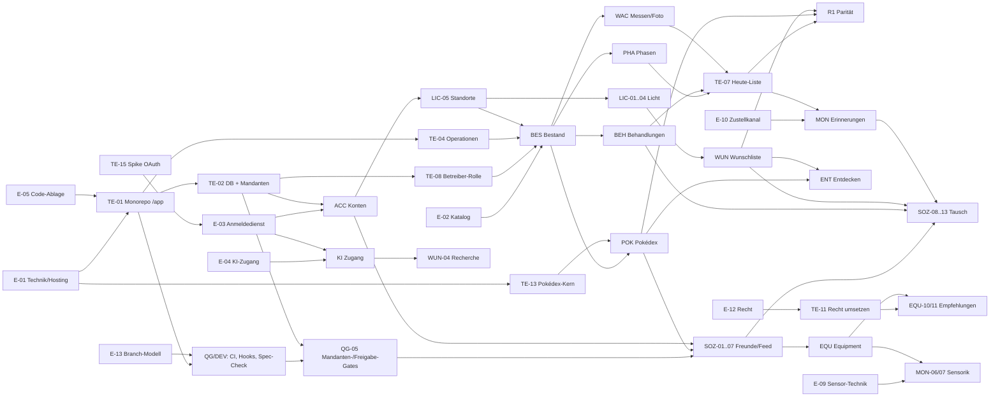

# PflanzenDex – Roadmap und Backlog-Analyse

Stand: 2026-10-03 · erzeugt aus den GitHub-Tickets (Quelle: Issues, Meilensteine, „Blocked by“), Specs in `Docs/PRODUKT-SPECS/` (Stand: Commit `de5e6a0`). **Die Specs bleiben maßgeblich**; Tickets und diese Roadmap sind eine Planungssicht darauf.

- GitHub-Projekt: [PflanzenDex Roadmap](https://github.com/orgs/PflanzenDex/projects/2) (privat; Felder Release, Typ, Epic, Größe, Welle)
- Tickets: [alle Issues](https://github.com/PflanzenDex/PflanzenDex/issues) · Meilensteine: [R0…R6, Stufe 2](https://github.com/PflanzenDex/PflanzenDex/milestones)
- Umfang: **175 offene Tickets** = 124 Userstories + 19 Entscheidungen + 14 Enabler (nicht in der Spec, abgeleitet) + 18 Sammel-Epics. Entfallen: 6 Tickets (Epic MIG, Import aus dem Vault).

## Was die Analyse zeigt

1. **Alles hängt an wenigen Entscheidungen.** E-01 (Technik und Hosting) blockiert transitiv 135 von 156 anderen Tickets. E-05 (Code-Ablage) und E-02 (Artenkatalog) sind entschieden, E-01 ist teilweise entschieden (offen: Hosting-Anbieter), E-03 (Anmeldedienst) ist nach dem Spike `TE-15` im Grundsatz entschieden (Keycloak); die Client-Anbindung ist mit `TE-16` noch nachzuweisen.
2. **R0 ist größer, als der Release-Schnitt wirkt.** Neben den fachlichen Stories verlangen `18`/`19`, dass CI, Hooks, Struktur-/Grenzprüfung, Spec-Check, Task-Runner und Skills **vor** dem ersten Fachcode stehen: 11 Prozess-Tickets in R0.
3. **Die Datenbasis-Kette ist der Engpass:** `TE-01 → TE-02 (DB + Mandantentrennung) → TE-08 (Betreiberrolle) → BES-01 → BES-02`. Danach öffnen sich fast alle Epics gleichzeitig.
4. **Spec-Konflikte und Lücken** sind mit dem Label `spec-lücke` markiert (Abschnitt unten).
5. **Ohne Import:** Das Epic MIG entfällt (Entscheidung 2026-10-03). Der Wechsel vom Vault heißt Neu-Erfassung (Risiko R-10).
6. **Stufe 2 (Externe)** hat harte Voraussetzungen: Recht (E-12 → TE-11), Beitragsmodell (E-08), Foto-Virenscan (E-17), Export/Löschung (US-ACC-04).

## Roadmap nach Releases

Reihenfolge nach Spec (`16`): R0 → R1 → … → R6. **Keine Termine:** Die Specs enthalten keine Aufwandsbasis, und P-08 verbietet erfundene Zahlen. Die Größen S/M/L/XL sind grobe Annahmen und dienen nur der Reihung.

| Meilenstein | Tickets | Stories | Entscheidungen | Enabler | Austrittskriterium |
|---|---|---|---|---|---|
| **R0 Fundament** | 38 | 27 | 6 | 5 | Die drei können Standorte, Arten und Exemplare in der App anlegen und ansehen; Gates (CI, Struktur, Grenzen, Spec-Check) stehen vor dem ersten Fachcode (18/19, „Umsetzungsreihenfolge“). |
| **R1 Parität** | 52 | 42 | 3 | 7 | Alles, was der Vault heute kann, ist in der App; alle drei können umschalten. Mobil nutzbar (PWA). Parität ist die Bedingung für Stufe 1 (13). |
| **R2 Soziales** | 8 | 8 | 0 | 0 | Freunde sehen freigegebene Neuzugänge; Mandanten- und Freigabe-Gates stehen, bevor der erste Freund etwas sieht. |
| **R3 Tausch und Erinnerungen** | 23 | 21 | 2 | 0 | Erster echter Tausch läuft atomar über die App; Erinnerungen und Entdecken binden die Nutzer. |
| **R4 KI-Zugang** | 14 | 12 | 1 | 1 | Eingabe ohne Formulare über den eigenen KI-Client; Rechte, Entwurfspflicht und Rate-Limits sind serverseitig erzwungen, bevor die erste Verbindung freigegeben wird. |
| **R5 Equipment** | 12 | 12 | 0 | 0 | Equipment und Bedarf; Empfehlungen erst nach Rechtsprüfung und mit Kennzeichnung. |
| **R6 Sensorik** | 3 | 2 | 1 | 0 | Sensor-Pilot an wenigen Pflanzen, nach Hardware-Entscheidung E-09. |
| **Stufe 2 – Öffnung für Externe** | 4 | 0 | 3 | 1 | Voraussetzung, bevor Externe Zugang bekommen: Recht und Datenschutz, Beitragsmodell, Foto-Virenscan. |

Ohne Meilenstein: [#173](https://github.com/PflanzenDex/PflanzenDex/issues/173) `E-19`, [#37](https://github.com/PflanzenDex/PflanzenDex/issues/37) `E-18`, [#26](https://github.com/PflanzenDex/PflanzenDex/issues/26) `E-07` (Stufe 3 bzw. später).

### Kritischer Pfad bis zum ersten echten Tausch (Stufe 1)

Längste Abhängigkeitskette (12 Schritte) bis `SOZ-11` (Übergabe bestätigen). Verzögerungen hier verschieben Stufe 1 direkt:

[#20](https://github.com/PflanzenDex/PflanzenDex/issues/20) `E-01` → [#38](https://github.com/PflanzenDex/PflanzenDex/issues/38) `TE-01` → [#39](https://github.com/PflanzenDex/PflanzenDex/issues/39) `TE-02` → [#45](https://github.com/PflanzenDex/PflanzenDex/issues/45) `TE-08` → [#57](https://github.com/PflanzenDex/PflanzenDex/issues/57) `BES-01` → [#58](https://github.com/PflanzenDex/PflanzenDex/issues/58) `BES-02` → [#80](https://github.com/PflanzenDex/PflanzenDex/issues/80) `BEH-01` → [#81](https://github.com/PflanzenDex/PflanzenDex/issues/81) `BEH-02` → [#114](https://github.com/PflanzenDex/PflanzenDex/issues/114) `SOZ-08` → [#115](https://github.com/PflanzenDex/PflanzenDex/issues/115) `SOZ-09` → [#116](https://github.com/PflanzenDex/PflanzenDex/issues/116) `SOZ-10` → [#117](https://github.com/PflanzenDex/PflanzenDex/issues/117) `SOZ-11`

Die längste Kette im ganzen Graphen hat 14 Schritte und endet bei [#105](https://github.com/PflanzenDex/PflanzenDex/issues/105) `MON-07` Klima- und Sensorstatus sehen. Parität (R1) ist laut `13` Voraussetzung für Stufe 1; die Ketten über Wunschliste, Pokédex und Heute-Liste laufen parallel und müssen rechtzeitig stehen.

### Blocker-Ranking

Tickets, auf die die meisten anderen transitiv warten:

| Rang | Ticket | wartende Tickets | Meilenstein |
|---|---|---|---|
| 1 | [#20](https://github.com/PflanzenDex/PflanzenDex/issues/20) `E-01` Technik und Hosting | 135 | R0 Fundament |
| 2 | [#24](https://github.com/PflanzenDex/PflanzenDex/issues/24) `E-05` Code-Ablage (/app im selben Repo) | 131 | R0 Fundament |
| 3 | [#38](https://github.com/PflanzenDex/PflanzenDex/issues/38) `TE-01` Monorepo-Gerüst unter /app anlegen (core / api / web) | 130 | R0 Fundament |
| 4 | [#39](https://github.com/PflanzenDex/PflanzenDex/issues/39) `TE-02` Datenbank-Grundlage mit Konto-Kennung, Zeilenebene-Regeln und Mandanten-Testrahmen | 109 | R0 Fundament |
| 5 | [#41](https://github.com/PflanzenDex/PflanzenDex/issues/41) `TE-04` Schicht der validierenden Operationen (Idempotenz, Fehlercodes) | 102 | R0 Fundament |
| 6 | [#22](https://github.com/PflanzenDex/PflanzenDex/issues/22) `E-03` Anmeldeverfahren und Dienst | 98 | R0 Fundament |
| 7 | [#52](https://github.com/PflanzenDex/PflanzenDex/issues/52) `ACC-01` Registrieren und anmelden | 96 | R0 Fundament |
| 8 | [#45](https://github.com/PflanzenDex/PflanzenDex/issues/45) `TE-08` Betreiber-Rolle und Katalog-Prüfworkflow | 93 | R0 Fundament |
| 9 | [#21](https://github.com/PflanzenDex/PflanzenDex/issues/21) `E-02` Artenkatalog: gemeinsam, Prüfung, Abweichungen | 89 | R0 Fundament |
| 10 | [#57](https://github.com/PflanzenDex/PflanzenDex/issues/57) `BES-01` Art aus dem Katalog wählen oder neu anlegen | 88 | R0 Fundament |
| 11 | [#69](https://github.com/PflanzenDex/PflanzenDex/issues/69) `LIC-05` Standorte und Lichtzonen verwalten | 79 | R0 Fundament |
| 12 | [#58](https://github.com/PflanzenDex/PflanzenDex/issues/58) `BES-02` Exemplar anlegen | 77 | R0 Fundament |
| 13 | [#40](https://github.com/PflanzenDex/PflanzenDex/issues/40) `TE-03` Hosting, Umgebungen und Deploy-Grundlage (Selbstbetrieb, EU) | 42 | R0 Fundament |
| 14 | [#66](https://github.com/PflanzenDex/PflanzenDex/issues/66) `LIC-02` Wissen, wo noch Platz ist | 38 | R1 Parität |
| 15 | [#84](https://github.com/PflanzenDex/PflanzenDex/issues/84) `WUN-01` Kandidaten nach Platzbedarf priorisiert sehen | 35 | R1 Parität |

## Entscheidungen: Stand und Fälligkeit

| Entscheidung | Stand | Spätestens vor | Blockiert direkt |
|---|---|---|---|
| [#20](https://github.com/PflanzenDex/PflanzenDex/issues/20) `E-01` Technik und Hosting | teilweise entschieden | R0 Fundament | `POK-03`, `TE-01`, `TE-03`, `TE-13` |
| [#21](https://github.com/PflanzenDex/PflanzenDex/issues/21) `E-02` Artenkatalog: gemeinsam, Prüfung, Abweichungen | im Grundsatz entschieden | R0 Fundament | `BES-01`, `BES-09`, `BES-10`, `POK-02` |
| [#22](https://github.com/PflanzenDex/PflanzenDex/issues/22) `E-03` Anmeldeverfahren und Dienst | im Grundsatz entschieden | R0 Fundament | `ACC-01`, `KI-07`, `TE-16` |
| [#23](https://github.com/PflanzenDex/PflanzenDex/issues/23) `E-04` KI-Zugang: Schnittstelle, Anmeldung, Rechte | im Grundsatz entschieden | R4 KI-Zugang | `KI-07` |
| [#24](https://github.com/PflanzenDex/PflanzenDex/issues/24) `E-05` Code-Ablage (/app im selben Repo) | entschieden | R0 Fundament | `TE-01` |
| [#25](https://github.com/PflanzenDex/PflanzenDex/issues/25) `E-06` PWA oder native App | offen | R1 Parität | `QS-07` |
| [#26](https://github.com/PflanzenDex/PflanzenDex/issues/26) `E-07` Verkauf gegen Geld erlauben? | offen | Stufe 3 / später | – |
| [#27](https://github.com/PflanzenDex/PflanzenDex/issues/27) `E-08` Freiwilliger Beitrag oder Abo | offen | Stufe 2 – Öffnung für Externe | – |
| [#28](https://github.com/PflanzenDex/PflanzenDex/issues/28) `E-09` Sensor-Technik | offen | R6 Sensorik | `MON-06` |
| [#29](https://github.com/PflanzenDex/PflanzenDex/issues/29) `E-10` Standard-Zustellkanal für Erinnerungen | offen | R3 Tausch und Erinnerungen | `MON-01` |
| [#30](https://github.com/PflanzenDex/PflanzenDex/issues/30) `E-11` Stecklinge im Messrhythmus | offen | R3 Tausch und Erinnerungen | `MON-04` |
| [#31](https://github.com/PflanzenDex/PflanzenDex/issues/31) `E-12` Rechtliches vor dem ersten Externen | offen | Stufe 2 – Öffnung für Externe | `TE-11` |
| [#32](https://github.com/PflanzenDex/PflanzenDex/issues/32) `E-13` CI-Plattform und Branch-Modell | entschieden | R0 Fundament | `DEV-06`, `QG-02` |
| [#33](https://github.com/PflanzenDex/PflanzenDex/issues/33) `E-14` Deploy-Freigabe | offen | R1 Parität | `DEV-06` |
| [#34](https://github.com/PflanzenDex/PflanzenDex/issues/34) `E-15` Schwellenwerte der Gates | entschieden | R0 Fundament | `QG-06` |
| [#35](https://github.com/PflanzenDex/PflanzenDex/issues/35) `E-16` Statische Analyse (Fallow/Semgrep) | entschieden | R1 Parität | `QG-08` |
| [#36](https://github.com/PflanzenDex/PflanzenDex/issues/36) `E-17` Foto-Virenscan | offen | Stufe 2 – Öffnung für Externe | – |
| [#37](https://github.com/PflanzenDex/PflanzenDex/issues/37) `E-18` Review-Automatik | offen | Stufe 3 / später | – |
| [#173](https://github.com/PflanzenDex/PflanzenDex/issues/173) `E-19` Eingebauter KI-Chat (BYOK) | offen | Stufe 3 / später | – |

Offene Entscheidungen in sinnvoller Reihenfolge: **E-01** (Hosting-Anbieter), **E-14, E-06** vor R1, **E-10, E-11** vor R3, **E-04** (Test an realen Clients, `TE-16`) vor R4, **E-12, E-08, E-17** vor Stufe 2, **E-09** vor R6.

## Abhängigkeiten im Überblick

Gröbere Sicht auf Epic-Ebene (die Einzelabhängigkeiten stehen als „Blocked by“ in den Tickets):

## Spec-Lücken und -Konflikte

Beim Planen aufgefallen; im jeweiligen Ticket als „Planungshinweis“ (Label `spec-lücke`).

- [#44](https://github.com/PflanzenDex/PflanzenDex/issues/44) `TE-07` „Heute“-Liste und zentrale `status`-Funktion: Die Startseite „Heute“ ist in `16` für R1 gefordert und in `FR-MON-03`/`US-QS-01` beschrieben, hat aber **keine eigene Story**. Gebraucht wird eine einzige `status`-Funktion in `core`, die Phasen-Abweichung, fällige Behandlung, überfällige Messung, Puffer-Warnung und Hinweise liefert, jeweils mit Handlungsanweisung (P-09). Erinnerungen (MON), KI-Tagesstatus (US-KI-02) und „Heute“ nutzen dieselbe Funktion (R-04).
- [#45](https://github.com/PflanzenDex/PflanzenDex/issues/45) `TE-08` Betreiber-Rolle und Katalog-Prüfworkflow: Rollenmodell (Pflanzenhalter, Betreiber/Prüfer) und Prüfstatus-Workflow für den gemeinsamen Katalog: Vorschläge, Prüfliste, `kuratiert`/`geprüft`/`KI-erstellt, ungeprüft` (FR-BES-02, FR-BES-06). Ohne Betreiber-Rolle gibt es weder Einladungscodes (US-ACC-05) noch Katalogpflege (US-POK-02). Eine Betreiber-Oberfläche ist in den Specs nirgends als Story beschrieben.
- [#55](https://github.com/PflanzenDex/PflanzenDex/issues/55) `ACC-04` Daten exportieren und Konto löschen: In `16` keinem Release zugeordnet. Hier R3, weil Tausch- und Freundesdaten im Export und die Löschregel für abgeschlossene Tausche (US-SOZ-10/13) vorkommen. **Pflicht vor Stufe 2** (NFR-11); ein reiner Export der eigenen Pflegedaten wäre schon früher möglich.
- [#79](https://github.com/PflanzenDex/PflanzenDex/issues/79) `WAC-06` Foto bewerten lassen und ablegen: **Release-Konflikt:** Epic WAC ist R1, die KI-Bewertung des Fotos ist aber US-KI-04 (R4). In R1 nur der Teil „Foto verarbeiten und ablegen“ (EXIF/GPS entfernen, ≤ 1600 px, Qualität 82); die KI-Bewertung hängt an US-KI-04.
- [#85](https://github.com/PflanzenDex/PflanzenDex/issues/85) `WUN-02` Vor leerer Liste gewarnt werden: Die Aktion „Vorschläge holen“ (US-WUN-04) gibt es erst ab R4, „Entdecken für <Zone>“ (US-ENT-07) ab R3. In R1/R2 zeigt die Warnung nur den Hinweis und manuelles Anlegen.
- [#87](https://github.com/PflanzenDex/PflanzenDex/issues/87) `WUN-04` Neue Kandidaten recherchieren lassen: **Release-Konflikt:** Epic WUN steht in R1, die Story braucht aber den KI-Zugang (US-KI-05 und Aufträge US-KI-08, R4). Hier deshalb nach R4 gelegt. In R1/R2 bleibt für Nachschub nur manuelles Anlegen; „Entdecken für <Zone>“ kommt mit R3.
- [#108](https://github.com/PflanzenDex/PflanzenDex/issues/108) `SOZ-02` Freundschaftsanfrage beantworten: Die Benachrichtigung (US-SOZ-12, MON) kommt erst in R3. In R2 genügt In-App-Anzeige („Heute“/Hinweise).
- [#138](https://github.com/PflanzenDex/PflanzenDex/issues/138) `QS-01` Nichts hängt am Erinnern: Inhaltlich Epic MON; in `16` nicht zugeordnet, hier R3 mit MON-01.
- [#158](https://github.com/PflanzenDex/PflanzenDex/issues/158) `QG-03` Architekturgrenzen sind maschinell geprüft: `FR-QG-05` verweist auf „NFR-ARC-01 der früheren Skizze“ (nur im Prototyp-Ordner, nicht im Produkt-Spec). Beim Umsetzen in eine eigene Regel-ID überführen.
- [#160](https://github.com/PflanzenDex/PflanzenDex/issues/160) `QG-05` Datenschutz und Mandantentrennung sind testpflichtig: `16`/`18` nennen QG-D1/QG-D2 erst „vor R2“, P-04/FR-ACC-02 verlangen Mandantentrennung aber ab der ersten Version. Empfehlung: Mandanten-Testrahmen + Zeilenebene-Regeln schon in R0 (**TE-02**); QG-D3/QG-D4 in R1; QG-D2 vor dem ersten sozialen Endpunkt.

## Sofort startbar

Ohne offene Vorbedingung: [#173](https://github.com/PflanzenDex/PflanzenDex/issues/173) `E-19`, [#171](https://github.com/PflanzenDex/PflanzenDex/issues/171) `DEV-08`, [#37](https://github.com/PflanzenDex/PflanzenDex/issues/37) `E-18`, [#36](https://github.com/PflanzenDex/PflanzenDex/issues/36) `E-17`, [#35](https://github.com/PflanzenDex/PflanzenDex/issues/35) `E-16`, [#34](https://github.com/PflanzenDex/PflanzenDex/issues/34) `E-15`, [#33](https://github.com/PflanzenDex/PflanzenDex/issues/33) `E-14`, [#32](https://github.com/PflanzenDex/PflanzenDex/issues/32) `E-13`, [#31](https://github.com/PflanzenDex/PflanzenDex/issues/31) `E-12`, [#30](https://github.com/PflanzenDex/PflanzenDex/issues/30) `E-11`, [#29](https://github.com/PflanzenDex/PflanzenDex/issues/29) `E-10`, [#28](https://github.com/PflanzenDex/PflanzenDex/issues/28) `E-09`, [#27](https://github.com/PflanzenDex/PflanzenDex/issues/27) `E-08`, [#26](https://github.com/PflanzenDex/PflanzenDex/issues/26) `E-07`, [#25](https://github.com/PflanzenDex/PflanzenDex/issues/25) `E-06`, [#24](https://github.com/PflanzenDex/PflanzenDex/issues/24) `E-05`, [#23](https://github.com/PflanzenDex/PflanzenDex/issues/23) `E-04`, [#22](https://github.com/PflanzenDex/PflanzenDex/issues/22) `E-03`, [#21](https://github.com/PflanzenDex/PflanzenDex/issues/21) `E-02`, [#20](https://github.com/PflanzenDex/PflanzenDex/issues/20) `E-01`. Dazu der stack-unabhängige Teil von [#159](https://github.com/PflanzenDex/PflanzenDex/issues/159) `QG-04` Spec, Code und Test hängen sichtbar zusammen (Spec-Konsistenz-Check), der schon im Spec-Repo möglich ist.

## Tickets nach Meilenstein und Welle

Welle = Abhängigkeitstiefe (0 = keine offene Vorbedingung). Tickets derselben Welle sind untereinander unabhängig und können parallel laufen.

### R0 Fundament

Die drei können Standorte, Arten und Exemplare in der App anlegen und ansehen; Gates (CI, Struktur, Grenzen, Spec-Check) stehen vor dem ersten Fachcode (18/19, „Umsetzungsreihenfolge“).

**Welle 0**

- 🔴 ⛔ [#20](https://github.com/PflanzenDex/PflanzenDex/issues/20) `E-01` Technik und Hosting · S
- ⛔ [#21](https://github.com/PflanzenDex/PflanzenDex/issues/21) `E-02` Artenkatalog: gemeinsam, Prüfung, Abweichungen · S
- ⛔ [#22](https://github.com/PflanzenDex/PflanzenDex/issues/22) `E-03` Anmeldeverfahren und Dienst · S
- ⛔ [#24](https://github.com/PflanzenDex/PflanzenDex/issues/24) `E-05` Code-Ablage (/app im selben Repo) · S
- [#32](https://github.com/PflanzenDex/PflanzenDex/issues/32) `E-13` CI-Plattform und Branch-Modell · S
- [#34](https://github.com/PflanzenDex/PflanzenDex/issues/34) `E-15` Schwellenwerte der Gates · S
- [#171](https://github.com/PflanzenDex/PflanzenDex/issues/171) `DEV-08` Paralleles Arbeiten ohne Kollisionen · S

**Welle 1**

- 🔴 ⛔ [#38](https://github.com/PflanzenDex/PflanzenDex/issues/38) `TE-01` Monorepo-Gerüst unter /app anlegen (core / api / web) · XL
- ⛔ [#40](https://github.com/PflanzenDex/PflanzenDex/issues/40) `TE-03` Hosting, Umgebungen und Deploy-Grundlage (Selbstbetrieb, EU) · L

**Welle 2**

- 🔴 ⛔ [#39](https://github.com/PflanzenDex/PflanzenDex/issues/39) `TE-02` Datenbank-Grundlage mit Konto-Kennung, Zeilenebene-Regeln und Mandanten-Testrahmen · XL
- ⛔ [#41](https://github.com/PflanzenDex/PflanzenDex/issues/41) `TE-04` Schicht der validierenden Operationen (Idempotenz, Fehlercodes) · L
- [#139](https://github.com/PflanzenDex/PflanzenDex/issues/139) `QS-02` Logik ist testbar · S
- [#156](https://github.com/PflanzenDex/PflanzenDex/issues/156) `QG-01` Fehler früh und lokal finden · M
- [#157](https://github.com/PflanzenDex/PflanzenDex/issues/157) `QG-02` CI entscheidet über den Merge · XL
- ⚠️ [#158](https://github.com/PflanzenDex/PflanzenDex/issues/158) `QG-03` Architekturgrenzen sind maschinell geprüft · L
- [#162](https://github.com/PflanzenDex/PflanzenDex/issues/162) `QG-07` KI-Agenten arbeiten innerhalb derselben Gates · S
- [#164](https://github.com/PflanzenDex/PflanzenDex/issues/164) `DEV-01` Ein Einstiegspunkt für alle Aufgaben (Task-Runner) · L
- [#167](https://github.com/PflanzenDex/PflanzenDex/issues/167) `DEV-04` Skills und Playbooks für wiederkehrende Aufgaben · L

**Welle 3**

- 🔴 ⛔ ⚠️ [#45](https://github.com/PflanzenDex/PflanzenDex/issues/45) `TE-08` Betreiber-Rolle und Katalog-Prüfworkflow · S
- ⛔ [#52](https://github.com/PflanzenDex/PflanzenDex/issues/52) `ACC-01` Registrieren und anmelden · L
- [#140](https://github.com/PflanzenDex/PflanzenDex/issues/140) `QS-03` Wiederholbar ohne Angst · S
- [#159](https://github.com/PflanzenDex/PflanzenDex/issues/159) `QG-04` Spec, Code und Test hängen sichtbar zusammen · L
- [#161](https://github.com/PflanzenDex/PflanzenDex/issues/161) `QG-06` Gates reifen, statt zu blockieren, was niemand erfüllen kann · S
- [#165](https://github.com/PflanzenDex/PflanzenDex/issues/165) `DEV-02` Hooks fangen früh, ohne zu nerven · S

**Welle 4**

- [#53](https://github.com/PflanzenDex/PflanzenDex/issues/53) `ACC-02` Profil und Einstellungen · S
- [#56](https://github.com/PflanzenDex/PflanzenDex/issues/56) `ACC-05` Zugang nur per Einladung (Anfangsphase) · M
- 🔴 ⛔ [#57](https://github.com/PflanzenDex/PflanzenDex/issues/57) `BES-01` Art aus dem Katalog wählen oder neu anlegen · L
- ⛔ [#69](https://github.com/PflanzenDex/PflanzenDex/issues/69) `LIC-05` Standorte und Lichtzonen verwalten · L
- [#168](https://github.com/PflanzenDex/PflanzenDex/issues/168) `DEV-05` Story-Lebenszyklus und Review-Prozess · S

**Welle 5**

- 🔴 ⛔ [#58](https://github.com/PflanzenDex/PflanzenDex/issues/58) `BES-02` Exemplar anlegen · M
- [#180](https://github.com/PflanzenDex/PflanzenDex/issues/180) `BES-10` Katalogvorschläge prüfen und freigeben · L

**Welle 6**

- [#54](https://github.com/PflanzenDex/PflanzenDex/issues/54) `ACC-03` Geführter Einstieg · M
- [#59](https://github.com/PflanzenDex/PflanzenDex/issues/59) `BES-03` Mehrere Exemplare einer Art unterscheiden · S
- [#60](https://github.com/PflanzenDex/PflanzenDex/issues/60) `BES-04` Steckling anlegen und eintopfen · M
- [#61](https://github.com/PflanzenDex/PflanzenDex/issues/61) `BES-05` Arten nach Schwierigkeit vergleichen · S
- [#62](https://github.com/PflanzenDex/PflanzenDex/issues/62) `BES-06` Exemplare als Karten sehen · S
- [#63](https://github.com/PflanzenDex/PflanzenDex/issues/63) `BES-07` Eingegangene oder abgegebene Pflanze archivieren · S
- [#64](https://github.com/PflanzenDex/PflanzenDex/issues/64) `BES-08` Unvollständige Daten erkennen · M

### R1 Parität

Alles, was der Vault heute kann, ist in der App; alle drei können umschalten. Mobil nutzbar (PWA). Parität ist die Bedingung für Stufe 1 (13).

**Welle 0**

- [#25](https://github.com/PflanzenDex/PflanzenDex/issues/25) `E-06` PWA oder native App · S
- [#33](https://github.com/PflanzenDex/PflanzenDex/issues/33) `E-14` Deploy-Freigabe · S
- [#35](https://github.com/PflanzenDex/PflanzenDex/issues/35) `E-16` Statische Analyse (Fallow/Semgrep) · S

**Welle 2**

- [#42](https://github.com/PflanzenDex/PflanzenDex/issues/42) `TE-05` Objektspeicher und Bild-Verarbeitungs-Infrastruktur · S
- [#43](https://github.com/PflanzenDex/PflanzenDex/issues/43) `TE-06` Job-Warteschlange und Hintergrundjobs · L
- [#47](https://github.com/PflanzenDex/PflanzenDex/issues/47) `TE-10` Kostenmessung je Konto (Hosting, Speicher, KI) · S
- [#50](https://github.com/PflanzenDex/PflanzenDex/issues/50) `TE-13` Prototyp-Logik für den Pokédex übernehmen (Python-Job bleibt, Logik nach `core`) · L
- [#172](https://github.com/PflanzenDex/PflanzenDex/issues/172) `DEV-09` Betrieb: Gesundheit, Alarme, Runbooks · L

**Welle 3**

- [#46](https://github.com/PflanzenDex/PflanzenDex/issues/46) `TE-09` Client für externe Quellen (Wikipedia, Wikidata, GBIF, OpenTree) · L
- ⚠️ [#160](https://github.com/PflanzenDex/PflanzenDex/issues/160) `QG-05` Datenschutz und Mandantentrennung sind testpflichtig · L
- [#163](https://github.com/PflanzenDex/PflanzenDex/issues/163) `QG-08` Komplexität bleibt beherrschbar · L
- [#169](https://github.com/PflanzenDex/PflanzenDex/issues/169) `DEV-06` Release-Prozess · XL
- [#170](https://github.com/PflanzenDex/PflanzenDex/issues/170) `DEV-07` Datenbank-Migrationen sind sicher · L

**Welle 4**

- [#144](https://github.com/PflanzenDex/PflanzenDex/issues/144) `QS-07` Mobil nutzbar · L

**Welle 5**

- [#65](https://github.com/PflanzenDex/PflanzenDex/issues/65) `LIC-01` Art der richtigen Lichtzone zuordnen · M

**Welle 6**

- [#66](https://github.com/PflanzenDex/PflanzenDex/issues/66) `LIC-02` Wissen, wo noch Platz ist · M
- [#67](https://github.com/PflanzenDex/PflanzenDex/issues/67) `LIC-03` Wissen, wie nah die Pflanze an die Lampe gehört · S
- [#74](https://github.com/PflanzenDex/PflanzenDex/issues/74) `WAC-01` Messung erfassen · M
- 🔴 [#80](https://github.com/PflanzenDex/PflanzenDex/issues/80) `BEH-01` Behandlungstermine planen · M
- [#90](https://github.com/PflanzenDex/PflanzenDex/issues/90) `POK-02` Katalog pflegen · L
- [#92](https://github.com/PflanzenDex/PflanzenDex/issues/92) `POK-06` Besitz automatisch aus meinen Pflanzen ableiten · M
- [#179](https://github.com/PflanzenDex/PflanzenDex/issues/179) `BES-09` Eigenes Pflegeprofil je Art anpassen · L

**Welle 7**

- [#49](https://github.com/PflanzenDex/PflanzenDex/issues/49) `TE-12` Katalogausbau auf 600+ Arten (laufende Batches) · L
- [#68](https://github.com/PflanzenDex/PflanzenDex/issues/68) `LIC-04` Einstufungsregeln nachschlagen · S
- [#70](https://github.com/PflanzenDex/PflanzenDex/issues/70) `PHA-01` Sehen, in welcher Phase jede Pflanze sein sollte · M
- [#75](https://github.com/PflanzenDex/PflanzenDex/issues/75) `WAC-02` Vergeilung beim Messen beurteilen · S
- [#76](https://github.com/PflanzenDex/PflanzenDex/issues/76) `WAC-03` Wachstumsrate und Trend gegen den eigenen Schnitt · L
- ⚠️ [#79](https://github.com/PflanzenDex/PflanzenDex/issues/79) `WAC-06` Foto bewerten lassen und ablegen · L
- 🔴 [#81](https://github.com/PflanzenDex/PflanzenDex/issues/81) `BEH-02` Offene Termine nach Dringlichkeit sehen · S
- [#82](https://github.com/PflanzenDex/PflanzenDex/issues/82) `BEH-03` Termin per Tipp abhaken · M
- [#84](https://github.com/PflanzenDex/PflanzenDex/issues/84) `WUN-01` Kandidaten nach Platzbedarf priorisiert sehen · L
- [#91](https://github.com/PflanzenDex/PflanzenDex/issues/91) `POK-03` Taxonomie und Anreicherung automatisch bauen · XL
- [#93](https://github.com/PflanzenDex/PflanzenDex/issues/93) `POK-07` Fangdatum und Foto ehrlich · L
- [#98](https://github.com/PflanzenDex/PflanzenDex/issues/98) `POK-12` „Neu gefangen" beim nächsten Besuch · S

**Welle 8**

- [#71](https://github.com/PflanzenDex/PflanzenDex/issues/71) `PHA-02` Abweichungen zuerst sehen · S
- [#73](https://github.com/PflanzenDex/PflanzenDex/issues/73) `PHA-04` Nächsten Phasenwechsel vorhersehen · S
- [#77](https://github.com/PflanzenDex/PflanzenDex/issues/77) `WAC-04` Vergeilung übersteuert den Trend · S
- [#78](https://github.com/PflanzenDex/PflanzenDex/issues/78) `WAC-05` Verlauf und Fotos ansehen · L
- [#83](https://github.com/PflanzenDex/PflanzenDex/issues/83) `BEH-04` Offene Behandlung auf der Exemplar-Karte sehen · S
- ⚠️ [#85](https://github.com/PflanzenDex/PflanzenDex/issues/85) `WUN-02` Vor leerer Liste gewarnt werden · S
- [#86](https://github.com/PflanzenDex/PflanzenDex/issues/86) `WUN-03` Kauf festhalten · S
- [#89](https://github.com/PflanzenDex/PflanzenDex/issues/89) `POK-01` Sammelkarten für Arten sehen · L
- [#96](https://github.com/PflanzenDex/PflanzenDex/issues/96) `POK-10` Sammler-Rang und Fortschritt · S
- [#97](https://github.com/PflanzenDex/PflanzenDex/issues/97) `POK-11` Meilensteine mit Handlungsanweisung · L
- [#142](https://github.com/PflanzenDex/PflanzenDex/issues/142) `QS-05` Datenschutz und Kontrolle · M

**Welle 9**

- ⚠️ [#44](https://github.com/PflanzenDex/PflanzenDex/issues/44) `TE-07` „Heute“-Liste und zentrale `status`-Funktion · L
- [#72](https://github.com/PflanzenDex/PflanzenDex/issues/72) `PHA-03` Umstellung per Tipp bestätigen · L
- [#88](https://github.com/PflanzenDex/PflanzenDex/issues/88) `WUN-05` Vom Kauf zur Pflanze kommen · M
- [#94](https://github.com/PflanzenDex/PflanzenDex/issues/94) `POK-08` Suchen, filtern, sortieren · S
- [#95](https://github.com/PflanzenDex/PflanzenDex/issues/95) `POK-09` Details zu einer Art ansehen · S
- [#143](https://github.com/PflanzenDex/PflanzenDex/issues/143) `QS-06` Quellen und Lizenzen · S

**Welle 10**

- [#141](https://github.com/PflanzenDex/PflanzenDex/issues/141) `QS-04` Abweichungen werden sichtbar · S

### R2 Soziales

Freunde sehen freigegebene Neuzugänge; Mandanten- und Freigabe-Gates stehen, bevor der erste Freund etwas sieht.

**Welle 3**

- [#166](https://github.com/PflanzenDex/PflanzenDex/issues/166) `DEV-03` Routinen: regelmäßig laufende Prüfungen und Pflege · L

**Welle 5**

- [#107](https://github.com/PflanzenDex/PflanzenDex/issues/107) `SOZ-01` Freundschaft anfragen · M

**Welle 6**

- ⚠️ [#108](https://github.com/PflanzenDex/PflanzenDex/issues/108) `SOZ-02` Freundschaftsanfrage beantworten · S
- [#110](https://github.com/PflanzenDex/PflanzenDex/issues/110) `SOZ-04` Selbst bestimmen, was Freunde sehen · L

**Welle 7**

- [#109](https://github.com/PflanzenDex/PflanzenDex/issues/109) `SOZ-03` Freunde verwalten und Freundschaft beenden · S

**Welle 8**

- [#111](https://github.com/PflanzenDex/PflanzenDex/issues/111) `SOZ-05` Sehen, welche neuen Pflanzen Freunde gesammelt haben · L

**Welle 9**

- [#112](https://github.com/PflanzenDex/PflanzenDex/issues/112) `SOZ-06` „Neu bei Freunden" seit meinem letzten Besuch · S
- [#113](https://github.com/PflanzenDex/PflanzenDex/issues/113) `SOZ-07` Sammlung eines Freundes ansehen und vergleichen · M

### R3 Tausch und Erinnerungen

Erster echter Tausch läuft atomar über die App; Erinnerungen und Entdecken binden die Nutzer.

**Welle 0**

- [#29](https://github.com/PflanzenDex/PflanzenDex/issues/29) `E-10` Standard-Zustellkanal für Erinnerungen · S
- [#30](https://github.com/PflanzenDex/PflanzenDex/issues/30) `E-11` Stecklinge im Messrhythmus · S

**Welle 8**

- 🔴 [#114](https://github.com/PflanzenDex/PflanzenDex/issues/114) `SOZ-08` Pflanze oder Steckling zum Tausch anbieten · L

**Welle 9**

- 🔴 [#115](https://github.com/PflanzenDex/PflanzenDex/issues/115) `SOZ-09` Angebote von Freunden sehen und anfragen · L
- [#148](https://github.com/PflanzenDex/PflanzenDex/issues/148) `ENT-01` Vorschläge einzeln als Karte sehen · M

**Welle 10**

- [#99](https://github.com/PflanzenDex/PflanzenDex/issues/99) `MON-01` Nur bei Handlungsbedarf benachrichtigt werden · XL
- 🔴 [#116](https://github.com/PflanzenDex/PflanzenDex/issues/116) `SOZ-10` Tauschanfrage beantworten · L
- [#149](https://github.com/PflanzenDex/PflanzenDex/issues/149) `ENT-02` Nur Arten sehen, die in Frage kommen · XL
- [#151](https://github.com/PflanzenDex/PflanzenDex/issues/151) `ENT-04` Entscheidung landet sofort in der Wunschliste · S

**Welle 11**

- [#100](https://github.com/PflanzenDex/PflanzenDex/issues/100) `MON-02` Am Phasenwechsel erinnert werden · S
- [#101](https://github.com/PflanzenDex/PflanzenDex/issues/101) `MON-03` Bei fälliger Behandlung erinnert werden · S
- [#102](https://github.com/PflanzenDex/PflanzenDex/issues/102) `MON-04` An überfällige Messung erinnert werden · S
- [#103](https://github.com/PflanzenDex/PflanzenDex/issues/103) `MON-05` Gießen ohne Sensor per Intervall erinnert werden · L
- [#106](https://github.com/PflanzenDex/PflanzenDex/issues/106) `MON-08` Erinnerungen steuern · S
- 🔴 [#117](https://github.com/PflanzenDex/PflanzenDex/issues/117) `SOZ-11` Übergabe bestätigen, Bestand und Pokédex nachführen · XL
- ⚠️ [#138](https://github.com/PflanzenDex/PflanzenDex/issues/138) `QS-01` Nichts hängt am Erinnern · S
- [#150](https://github.com/PflanzenDex/PflanzenDex/issues/150) `ENT-03` Verstehen, warum etwas vorgeschlagen wird · L
- [#152](https://github.com/PflanzenDex/PflanzenDex/issues/152) `ENT-05` Vorschläge lernen aus meinen Entscheidungen · L
- [#153](https://github.com/PflanzenDex/PflanzenDex/issues/153) `ENT-06` Auch Überraschendes sehen · S
- [#154](https://github.com/PflanzenDex/PflanzenDex/issues/154) `ENT-07` Aus der Puffer-Warnung direkt entdecken · S

**Welle 12**

- [#118](https://github.com/PflanzenDex/PflanzenDex/issues/118) `SOZ-12` Über Neues benachrichtigt werden · M
- [#119](https://github.com/PflanzenDex/PflanzenDex/issues/119) `SOZ-13` Tauschhistorie · S

**Welle 13**

- ⚠️ [#55](https://github.com/PflanzenDex/PflanzenDex/issues/55) `ACC-04` Daten exportieren und Konto löschen · M

### R4 KI-Zugang

Eingabe ohne Formulare über den eigenen KI-Client; Rechte, Entwurfspflicht und Rate-Limits sind serverseitig erzwungen, bevor die erste Verbindung freigegeben wird.

**Welle 0**

- [#23](https://github.com/PflanzenDex/PflanzenDex/issues/23) `E-04` KI-Zugang: Schnittstelle, Anmeldung, Rechte · S

**Welle 1**

- [#181](https://github.com/PflanzenDex/PflanzenDex/issues/181) `TE-16` Anbindung von Claude und ChatGPT an Keycloak nachweisen · M

**Welle 4**

- [#174](https://github.com/PflanzenDex/PflanzenDex/issues/174) `KI-07` KI-Client verbinden und Zugriff verwalten · L

**Welle 5**

- [#137](https://github.com/PflanzenDex/PflanzenDex/issues/137) `KI-06` Grenzen, Transparenz und Datenschutz · S
- [#176](https://github.com/PflanzenDex/PflanzenDex/issues/176) `KI-09` Entwürfe prüfen und übernehmen · M
- [#177](https://github.com/PflanzenDex/PflanzenDex/issues/177) `KI-10` Protokoll der KI-Aktionen und Rückgängig · M

**Welle 6**

- [#132](https://github.com/PflanzenDex/PflanzenDex/issues/132) `KI-01` Pflege per Sprache über den KI-Client · XL
- [#136](https://github.com/PflanzenDex/PflanzenDex/issues/136) `KI-05` Recherche über den KI-Client (Wunschliste, Equipment, Katalog) · L
- [#175](https://github.com/PflanzenDex/PflanzenDex/issues/175) `KI-08` Aufträge aus der App an den KI-Client · L

**Welle 7**

- [#134](https://github.com/PflanzenDex/PflanzenDex/issues/134) `KI-03` Artprofil als Entwurf liefern · L

**Welle 8**

- ⚠️ [#87](https://github.com/PflanzenDex/PflanzenDex/issues/87) `WUN-04` Neue Kandidaten recherchieren lassen · M
- [#135](https://github.com/PflanzenDex/PflanzenDex/issues/135) `KI-04` Foto qualitativ bewerten lassen · L

**Welle 10**

- [#133](https://github.com/PflanzenDex/PflanzenDex/issues/133) `KI-02` Tagesstatus auf Zuruf · S

**Welle 11**

- [#155](https://github.com/PflanzenDex/PflanzenDex/issues/155) `ENT-08` Vorschläge über den KI-Client · S

### R5 Equipment

Equipment und Bedarf; Empfehlungen erst nach Rechtsprüfung und mit Kennzeichnung.

**Welle 4**

- [#120](https://github.com/PflanzenDex/PflanzenDex/issues/120) `EQU-01` Equipment erfassen · M

**Welle 5**

- [#125](https://github.com/PflanzenDex/PflanzenDex/issues/125) `EQU-06` Sensoren und Zubehör zuordnen · S
- [#128](https://github.com/PflanzenDex/PflanzenDex/issues/128) `EQU-09` Kosten sehen · S

**Welle 7**

- [#121](https://github.com/PflanzenDex/PflanzenDex/issues/121) `EQU-02` Lampen an Lichtzonen binden · L
- [#124](https://github.com/PflanzenDex/PflanzenDex/issues/124) `EQU-05` Verbrauchsmaterial und Vorrat · M

**Welle 8**

- [#122](https://github.com/PflanzenDex/PflanzenDex/issues/122) `EQU-03` Gemessene Lichtstärke je Lampe festhalten · M
- [#126](https://github.com/PflanzenDex/PflanzenDex/issues/126) `EQU-07` Was fehlt? Bedarf aus eigenen Daten ableiten · L

**Welle 9**

- [#127](https://github.com/PflanzenDex/PflanzenDex/issues/127) `EQU-08` Kauf übernehmen · M
- [#129](https://github.com/PflanzenDex/PflanzenDex/issues/129) `EQU-10` Passende Empfehlungen sehen · L

**Welle 10**

- [#130](https://github.com/PflanzenDex/PflanzenDex/issues/130) `EQU-11` Empfehlungen steuern und verstehen · S
- [#131](https://github.com/PflanzenDex/PflanzenDex/issues/131) `EQU-12` Equipment mit Freunden teilen (optional) · M

**Welle 11**

- [#123](https://github.com/PflanzenDex/PflanzenDex/issues/123) `EQU-04` Betrieb und Wartung im Blick · M

### R6 Sensorik

Sensor-Pilot an wenigen Pflanzen, nach Hardware-Entscheidung E-09.

**Welle 0**

- [#28](https://github.com/PflanzenDex/PflanzenDex/issues/28) `E-09` Sensor-Technik · S

**Welle 12**

- [#104](https://github.com/PflanzenDex/PflanzenDex/issues/104) `MON-06` Bodenfeuchte per Sensor erfassen · L

**Welle 13**

- [#105](https://github.com/PflanzenDex/PflanzenDex/issues/105) `MON-07` Klima- und Sensorstatus sehen · M

### Stufe 2 – Öffnung für Externe

Voraussetzung, bevor Externe Zugang bekommen: Recht und Datenschutz, Beitragsmodell, Foto-Virenscan.

**Welle 0**

- [#27](https://github.com/PflanzenDex/PflanzenDex/issues/27) `E-08` Freiwilliger Beitrag oder Abo · S
- [#31](https://github.com/PflanzenDex/PflanzenDex/issues/31) `E-12` Rechtliches vor dem ersten Externen · S
- [#36](https://github.com/PflanzenDex/PflanzenDex/issues/36) `E-17` Foto-Virenscan · S

**Welle 1**

- [#48](https://github.com/PflanzenDex/PflanzenDex/issues/48) `TE-11` Rechtliches vor dem ersten Externen umsetzen · S

Legende: 🔴 kritischer Pfad · ⛔ Blocker (≥ 40 wartende Tickets) · ⚠️ Spec-Lücke/-Konflikt · S/M/L/XL = grobe Größenannahme.

## Pflege

Diese Datei wird aus den GitHub-Tickets erzeugt. Bei Änderungen an Specs gilt die Spec; das Ticket dann anpassen. Status ⬜/🟨/✅ in der Spec wird weiterhin im selben PR wie der Code geführt (US-DEV-05).
