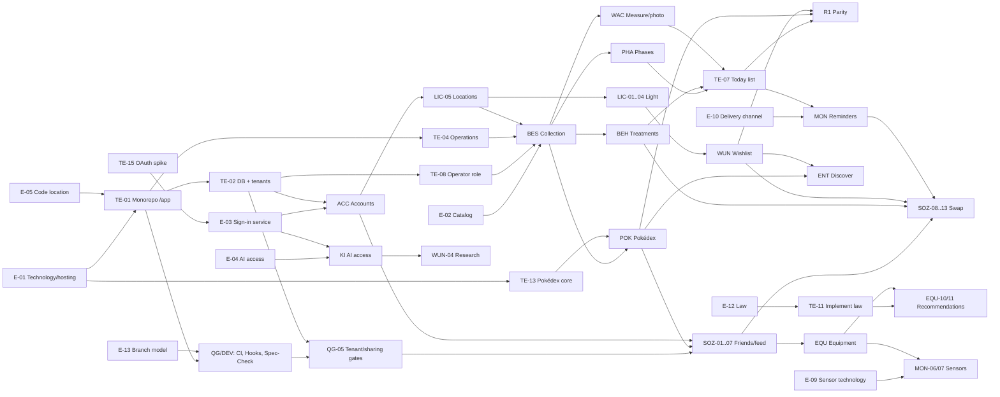

# PflanzenDex – Roadmap and Backlog Analysis

As of: 2026-10-03 · generated from the GitHub tickets (source: issues, milestones, "Blocked by"), specs in `Docs/PRODUCT-SPECS/` (state: commit `de5e6a0`). **The specs remain authoritative**; tickets and this roadmap are a planning view on them. The ticket titles are the German titles of the GitHub issues, translated here.

- GitHub project: [PflanzenDex Roadmap](https://github.com/orgs/PflanzenDex/projects/2) (private; fields release, type, epic, size, wave)
- Tickets: [all issues](https://github.com/PflanzenDex/PflanzenDex/issues) · Milestones: [R0…R6, stage 2](https://github.com/PflanzenDex/PflanzenDex/milestones)
- Scope: **175 open tickets** = 124 user stories + 19 decisions + 14 enablers (not in the spec, derived) + 18 collective epics. Dropped: 6 tickets (epic MIG, import from the vault).

## What the analysis shows

1. **Everything depends on a few decisions.** E-01 (technology and hosting) transitively blocks 135 of 156 other tickets. E-05 (code location) and E-02 (species catalog) are decided, E-01 is partly decided (open: hosting provider), E-03 (sign-in service) is decided in principle after the spike `TE-15` (Keycloak); the client connection is still to be proven with `TE-16`.
2. **R0 is bigger than the release cut suggests.** Besides the domain stories, `18`/`19` demand that CI, hooks, structure/boundary checks, spec check, task runner and skills stand **before** the first domain code: 11 process tickets in R0.
3. **The data foundation chain is the bottleneck:** `TE-01 → TE-02 (DB + tenant isolation) → TE-08 (operator role) → BES-01 → BES-02`. After that almost all epics open at the same time.
4. **Spec conflicts and gaps** are marked with the label `spec-lücke` (section below).
5. **Without import:** the epic MIG is dropped (decision 2026-10-03). Switching from the vault means re-entry (risk R-10).
6. **Stage 2 (externals)** has hard preconditions: law (E-12 → TE-11), contribution model (E-08), photo virus scan (E-17), export/deletion (US-ACC-04).

## Roadmap by release

Order per spec (`16`): R0 → R1 → … → R6. **No dates:** the specs contain no effort basis, and P-08 forbids invented numbers. The sizes S/M/L/XL are rough assumptions and serve only for ordering.

| Milestone | Tickets | Stories | Decisions | Enablers | Exit criterion |
|---|---|---|---|---|---|
| **R0 Foundation** | 38 | 27 | 6 | 5 | The three can create and view locations, species and specimens in the app; gates (CI, structure, boundaries, spec check) stand before the first domain code (18/19, "Implementation order"). |
| **R1 Parity** | 52 | 42 | 3 | 7 | Everything the vault can do today is in the app; all three can switch. Usable on mobile (PWA). Parity is the condition for stage 1 (13). |
| **R2 Social** | 8 | 8 | 0 | 0 | Friends see shared new acquisitions; tenant and sharing gates stand before the first friend sees anything. |
| **R3 Swapping and reminders** | 23 | 21 | 2 | 0 | First real swap runs atomically via the app; reminders and Discover engage the users. |
| **R4 AI access** | 14 | 12 | 1 | 1 | Input without forms via the own AI client; rights, draft duty and rate limits are enforced server-side before the first connection is released. |
| **R5 Equipment** | 12 | 12 | 0 | 0 | Equipment and need; recommendations only after legal review and with labeling. |
| **R6 Sensors** | 3 | 2 | 1 | 0 | Sensor pilot on a few plants, after the hardware decision E-09. |
| **Stage 2 – opening for externals** | 4 | 0 | 3 | 1 | Precondition before externals get access: law and privacy, contribution model, photo virus scan. |

Without milestone: [#173](https://github.com/PflanzenDex/PflanzenDex/issues/173) `E-19`, [#37](https://github.com/PflanzenDex/PflanzenDex/issues/37) `E-18`, [#26](https://github.com/PflanzenDex/PflanzenDex/issues/26) `E-07` (stage 3 or later).

### Critical path to the first real swap (stage 1)

Longest dependency chain (12 steps) up to `SOZ-11` (confirm handover). Delays here shift stage 1 directly:

[#20](https://github.com/PflanzenDex/PflanzenDex/issues/20) `E-01` → [#38](https://github.com/PflanzenDex/PflanzenDex/issues/38) `TE-01` → [#39](https://github.com/PflanzenDex/PflanzenDex/issues/39) `TE-02` → [#45](https://github.com/PflanzenDex/PflanzenDex/issues/45) `TE-08` → [#57](https://github.com/PflanzenDex/PflanzenDex/issues/57) `BES-01` → [#58](https://github.com/PflanzenDex/PflanzenDex/issues/58) `BES-02` → [#80](https://github.com/PflanzenDex/PflanzenDex/issues/80) `BEH-01` → [#81](https://github.com/PflanzenDex/PflanzenDex/issues/81) `BEH-02` → [#114](https://github.com/PflanzenDex/PflanzenDex/issues/114) `SOZ-08` → [#115](https://github.com/PflanzenDex/PflanzenDex/issues/115) `SOZ-09` → [#116](https://github.com/PflanzenDex/PflanzenDex/issues/116) `SOZ-10` → [#117](https://github.com/PflanzenDex/PflanzenDex/issues/117) `SOZ-11`

The longest chain in the whole graph has 14 steps and ends at [#105](https://github.com/PflanzenDex/PflanzenDex/issues/105) `MON-07` See climate and sensor status. Parity (R1) is a precondition for stage 1 per `13`; the chains via wishlist, Pokédex and Today list run in parallel and must be in place in time.

### Blocker ranking

Tickets that most others transitively wait for:

| Rank | Ticket | waiting tickets | Milestone |
|---|---|---|---|
| 1 | [#20](https://github.com/PflanzenDex/PflanzenDex/issues/20) `E-01` Technology and hosting | 135 | R0 Foundation |
| 2 | [#24](https://github.com/PflanzenDex/PflanzenDex/issues/24) `E-05` Code location (/app in the same repo) | 131 | R0 Foundation |
| 3 | [#38](https://github.com/PflanzenDex/PflanzenDex/issues/38) `TE-01` Create the monorepo scaffold under /app (core / api / web) | 130 | R0 Foundation |
| 4 | [#39](https://github.com/PflanzenDex/PflanzenDex/issues/39) `TE-02` Database foundation with account id, row-level rules and tenant test harness | 109 | R0 Foundation |
| 5 | [#41](https://github.com/PflanzenDex/PflanzenDex/issues/41) `TE-04` Layer of validating operations (idempotency, error codes) | 102 | R0 Foundation |
| 6 | [#22](https://github.com/PflanzenDex/PflanzenDex/issues/22) `E-03` Sign-in method and service | 98 | R0 Foundation |
| 7 | [#52](https://github.com/PflanzenDex/PflanzenDex/issues/52) `ACC-01` Register and sign in | 96 | R0 Foundation |
| 8 | [#45](https://github.com/PflanzenDex/PflanzenDex/issues/45) `TE-08` Operator role and catalog review workflow | 93 | R0 Foundation |
| 9 | [#21](https://github.com/PflanzenDex/PflanzenDex/issues/21) `E-02` Species catalog: shared, review, deviations | 89 | R0 Foundation |
| 10 | [#57](https://github.com/PflanzenDex/PflanzenDex/issues/57) `BES-01` Choose a species from the catalog or create a new one | 88 | R0 Foundation |
| 11 | [#69](https://github.com/PflanzenDex/PflanzenDex/issues/69) `LIC-05` Manage locations and light zones | 79 | R0 Foundation |
| 12 | [#58](https://github.com/PflanzenDex/PflanzenDex/issues/58) `BES-02` Create a specimen | 77 | R0 Foundation |
| 13 | [#40](https://github.com/PflanzenDex/PflanzenDex/issues/40) `TE-03` Hosting, environments and deploy foundation (self-operation, EU) | 42 | R0 Foundation |
| 14 | [#66](https://github.com/PflanzenDex/PflanzenDex/issues/66) `LIC-02` Know where there is still room | 38 | R1 Parity |
| 15 | [#84](https://github.com/PflanzenDex/PflanzenDex/issues/84) `WUN-01` See candidates prioritized by space need | 35 | R1 Parity |

## Decisions: state and due date

| Decision | State | At the latest before | Directly blocks |
|---|---|---|---|
| [#20](https://github.com/PflanzenDex/PflanzenDex/issues/20) `E-01` Technology and hosting | partly decided | R0 Foundation | `POK-03`, `TE-01`, `TE-03`, `TE-13` |
| [#21](https://github.com/PflanzenDex/PflanzenDex/issues/21) `E-02` Species catalog: shared, review, deviations | decided in principle | R0 Foundation | `BES-01`, `BES-09`, `BES-10`, `POK-02` |
| [#22](https://github.com/PflanzenDex/PflanzenDex/issues/22) `E-03` Sign-in method and service | decided in principle | R0 Foundation | `ACC-01`, `KI-07`, `TE-16` |
| [#23](https://github.com/PflanzenDex/PflanzenDex/issues/23) `E-04` AI access: interface, sign-in, rights | decided in principle | R4 AI access | `KI-07` |
| [#24](https://github.com/PflanzenDex/PflanzenDex/issues/24) `E-05` Code location (/app in the same repo) | decided | R0 Foundation | `TE-01` |
| [#25](https://github.com/PflanzenDex/PflanzenDex/issues/25) `E-06` PWA or native app | open | R1 Parity | `QS-07` |
| [#26](https://github.com/PflanzenDex/PflanzenDex/issues/26) `E-07` Allow selling for money? | open | Stage 3 / later | – |
| [#27](https://github.com/PflanzenDex/PflanzenDex/issues/27) `E-08` Voluntary contribution or subscription | open | Stage 2 – opening for externals | – |
| [#28](https://github.com/PflanzenDex/PflanzenDex/issues/28) `E-09` Sensor technology | open | R6 Sensors | `MON-06` |
| [#29](https://github.com/PflanzenDex/PflanzenDex/issues/29) `E-10` Default delivery channel for reminders | open | R3 Swapping and reminders | `MON-01` |
| [#30](https://github.com/PflanzenDex/PflanzenDex/issues/30) `E-11` Cuttings in the measuring rhythm | open | R3 Swapping and reminders | `MON-04` |
| [#31](https://github.com/PflanzenDex/PflanzenDex/issues/31) `E-12` Legal matters before the first external user | open | Stage 2 – opening for externals | `TE-11` |
| [#32](https://github.com/PflanzenDex/PflanzenDex/issues/32) `E-13` CI platform and branch model | decided | R0 Foundation | `DEV-06`, `QG-02` |
| [#33](https://github.com/PflanzenDex/PflanzenDex/issues/33) `E-14` Deploy approval | open | R1 Parity | `DEV-06` |
| [#34](https://github.com/PflanzenDex/PflanzenDex/issues/34) `E-15` Threshold values of the gates | decided | R0 Foundation | `QG-06` |
| [#35](https://github.com/PflanzenDex/PflanzenDex/issues/35) `E-16` Static analysis (Fallow/Semgrep) | decided | R1 Parity | `QG-08` |
| [#36](https://github.com/PflanzenDex/PflanzenDex/issues/36) `E-17` Photo virus scan | open | Stage 2 – opening for externals | – |
| [#37](https://github.com/PflanzenDex/PflanzenDex/issues/37) `E-18` Review automation | open | Stage 3 / later | – |
| [#173](https://github.com/PflanzenDex/PflanzenDex/issues/173) `E-19` Built-in AI chat (BYOK) | open | Stage 3 / later | – |

Open decisions in a sensible order: **E-01** (hosting provider), **E-14, E-06** before R1, **E-10, E-11** before R3, **E-04** (test on real clients, `TE-16`) before R4, **E-12, E-08, E-17** before stage 2, **E-09** before R6.

## Dependencies at a glance

Coarser view at epic level (the individual dependencies are "Blocked by" in the tickets):

## Spec gaps and conflicts

Noticed while planning; in the respective ticket as a "planning note" (label `spec-lücke`).

- [#44](https://github.com/PflanzenDex/PflanzenDex/issues/44) `TE-07` "Today" list and central `status` function: the start page "Today" is demanded in `16` for R1 and described in `FR-MON-03`/`US-QS-01`, but has **no story of its own**. What is needed is a single `status` function in `core` that delivers phase deviation, due treatment, overdue measurement, buffer warning and hints, each with an instruction for action (P-09). Reminders (MON), the AI daily status (US-KI-02) and "Today" use the same function (R-04).
- [#45](https://github.com/PflanzenDex/PflanzenDex/issues/45) `TE-08` Operator role and catalog review workflow: role model (plant keeper, operator/reviewer) and review status workflow for the shared catalog: proposals, review list, `curated`/`reviewed`/`ai-created, unreviewed` (FR-BES-02, FR-BES-06). Without the operator role there are neither invitation codes (US-ACC-05) nor catalog maintenance (US-POK-02). An operator interface is described nowhere in the specs as a story.
- [#55](https://github.com/PflanzenDex/PflanzenDex/issues/55) `ACC-04` Export data and delete account: not assigned to any release in `16`. Placed in R3 here, because swap and friend data occur in the export and the deletion rule for completed swaps (US-SOZ-10/13). **Mandatory before stage 2** (NFR-11); a pure export of the own care data would be possible earlier.
- [#79](https://github.com/PflanzenDex/PflanzenDex/issues/79) `WAC-06` Have a photo assessed and store it: **release conflict:** epic WAC is R1, but the AI assessment of the photo is US-KI-04 (R4). In R1 only the part "process and store photo" (remove EXIF/GPS, ≤ 1600 px, quality 82); the AI assessment hangs on US-KI-04.
- [#85](https://github.com/PflanzenDex/PflanzenDex/issues/85) `WUN-02` Be warned before the list is empty: the action "Fetch suggestions" (US-WUN-04) exists only from R4, "Discover for <zone>" (US-ENT-07) from R3. In R1/R2 the warning shows only the hint and manual creation.
- [#87](https://github.com/PflanzenDex/PflanzenDex/issues/87) `WUN-04` Have new candidates researched: **release conflict:** epic WUN is in R1, but the story needs the AI access (US-KI-05 and tasks US-KI-08, R4). Therefore placed in R4 here. In R1/R2 only manual creation remains for replenishment; "Discover for <zone>" comes with R3.
- [#108](https://github.com/PflanzenDex/PflanzenDex/issues/108) `SOZ-02` Answer a friendship request: the notification (US-SOZ-12, MON) comes only in R3. In R2 an in-app display ("Today"/hints) suffices.
- [#138](https://github.com/PflanzenDex/PflanzenDex/issues/138) `QS-01` Nothing depends on remembering: in terms of content epic MON; not assigned in `16`, placed here in R3 with MON-01.
- [#158](https://github.com/PflanzenDex/PflanzenDex/issues/158) `QG-03` Architecture boundaries are checked by machine: `FR-QG-05` refers to "NFR-ARC-01 of the earlier sketch" (only in the prototype folder, not in the product spec). Transfer into a rule ID of its own when implementing.
- [#160](https://github.com/PflanzenDex/PflanzenDex/issues/160) `QG-05` Privacy and tenant isolation require tests: `16`/`18` name QG-D1/QG-D2 only "before R2", but P-04/FR-ACC-02 demand tenant isolation from the first version. Recommendation: tenant test harness + row-level rules already in R0 (**TE-02**); QG-D3/QG-D4 in R1; QG-D2 before the first social endpoint.

## Can start immediately

Without an open precondition: [#173](https://github.com/PflanzenDex/PflanzenDex/issues/173) `E-19`, [#171](https://github.com/PflanzenDex/PflanzenDex/issues/171) `DEV-08`, [#37](https://github.com/PflanzenDex/PflanzenDex/issues/37) `E-18`, [#36](https://github.com/PflanzenDex/PflanzenDex/issues/36) `E-17`, [#35](https://github.com/PflanzenDex/PflanzenDex/issues/35) `E-16`, [#34](https://github.com/PflanzenDex/PflanzenDex/issues/34) `E-15`, [#33](https://github.com/PflanzenDex/PflanzenDex/issues/33) `E-14`, [#32](https://github.com/PflanzenDex/PflanzenDex/issues/32) `E-13`, [#31](https://github.com/PflanzenDex/PflanzenDex/issues/31) `E-12`, [#30](https://github.com/PflanzenDex/PflanzenDex/issues/30) `E-11`, [#29](https://github.com/PflanzenDex/PflanzenDex/issues/29) `E-10`, [#28](https://github.com/PflanzenDex/PflanzenDex/issues/28) `E-09`, [#27](https://github.com/PflanzenDex/PflanzenDex/issues/27) `E-08`, [#26](https://github.com/PflanzenDex/PflanzenDex/issues/26) `E-07`, [#25](https://github.com/PflanzenDex/PflanzenDex/issues/25) `E-06`, [#24](https://github.com/PflanzenDex/PflanzenDex/issues/24) `E-05`, [#23](https://github.com/PflanzenDex/PflanzenDex/issues/23) `E-04`, [#22](https://github.com/PflanzenDex/PflanzenDex/issues/22) `E-03`, [#21](https://github.com/PflanzenDex/PflanzenDex/issues/21) `E-02`, [#20](https://github.com/PflanzenDex/PflanzenDex/issues/20) `E-01`. In addition the stack-independent part of [#159](https://github.com/PflanzenDex/PflanzenDex/issues/159) `QG-04` Spec, code and test visibly belong together (spec consistency check), which is already possible in the spec repo.

## Tickets by milestone and wave

Wave = dependency depth (0 = no open precondition). Tickets of the same wave are independent of each other and can run in parallel.

### R0 Foundation

The three can create and view locations, species and specimens in the app; gates (CI, structure, boundaries, spec check) stand before the first domain code (18/19, "Implementation order").

**Wave 0**

- 🔴 ⛔ [#20](https://github.com/PflanzenDex/PflanzenDex/issues/20) `E-01` Technology and hosting · S
- ⛔ [#21](https://github.com/PflanzenDex/PflanzenDex/issues/21) `E-02` Species catalog: shared, review, deviations · S
- ⛔ [#22](https://github.com/PflanzenDex/PflanzenDex/issues/22) `E-03` Sign-in method and service · S
- ⛔ [#24](https://github.com/PflanzenDex/PflanzenDex/issues/24) `E-05` Code location (/app in the same repo) · S
- [#32](https://github.com/PflanzenDex/PflanzenDex/issues/32) `E-13` CI platform and branch model · S
- [#34](https://github.com/PflanzenDex/PflanzenDex/issues/34) `E-15` Threshold values of the gates · S
- [#171](https://github.com/PflanzenDex/PflanzenDex/issues/171) `DEV-08` Parallel work without collisions · S

**Wave 1**

- 🔴 ⛔ [#38](https://github.com/PflanzenDex/PflanzenDex/issues/38) `TE-01` Create the monorepo scaffold under /app (core / api / web) · XL
- ⛔ [#40](https://github.com/PflanzenDex/PflanzenDex/issues/40) `TE-03` Hosting, environments and deploy foundation (self-operation, EU) · L

**Wave 2**

- 🔴 ⛔ [#39](https://github.com/PflanzenDex/PflanzenDex/issues/39) `TE-02` Database foundation with account id, row-level rules and tenant test harness · XL
- ⛔ [#41](https://github.com/PflanzenDex/PflanzenDex/issues/41) `TE-04` Layer of validating operations (idempotency, error codes) · L
- [#139](https://github.com/PflanzenDex/PflanzenDex/issues/139) `QS-02` Logic is testable · S
- [#156](https://github.com/PflanzenDex/PflanzenDex/issues/156) `QG-01` Find errors early and locally · M
- [#157](https://github.com/PflanzenDex/PflanzenDex/issues/157) `QG-02` CI decides on the merge · XL
- ⚠️ [#158](https://github.com/PflanzenDex/PflanzenDex/issues/158) `QG-03` Architecture boundaries are checked by machine · L
- [#162](https://github.com/PflanzenDex/PflanzenDex/issues/162) `QG-07` AI agents work within the same gates · S
- [#164](https://github.com/PflanzenDex/PflanzenDex/issues/164) `DEV-01` One entry point for all tasks (task runner) · L
- [#167](https://github.com/PflanzenDex/PflanzenDex/issues/167) `DEV-04` Skills and playbooks for recurring tasks · L

**Wave 3**

- 🔴 ⛔ ⚠️ [#45](https://github.com/PflanzenDex/PflanzenDex/issues/45) `TE-08` Operator role and catalog review workflow · S
- ⛔ [#52](https://github.com/PflanzenDex/PflanzenDex/issues/52) `ACC-01` Register and sign in · L
- [#140](https://github.com/PflanzenDex/PflanzenDex/issues/140) `QS-03` Repeatable without fear · S
- [#159](https://github.com/PflanzenDex/PflanzenDex/issues/159) `QG-04` Spec, code and test visibly belong together · L
- [#161](https://github.com/PflanzenDex/PflanzenDex/issues/161) `QG-06` Gates mature instead of blocking what nobody can meet · S
- [#165](https://github.com/PflanzenDex/PflanzenDex/issues/165) `DEV-02` Hooks catch early without annoying · S

**Wave 4**

- [#53](https://github.com/PflanzenDex/PflanzenDex/issues/53) `ACC-02` Profile and settings · S
- [#56](https://github.com/PflanzenDex/PflanzenDex/issues/56) `ACC-05` Access by invitation only (initial phase) · M
- 🔴 ⛔ [#57](https://github.com/PflanzenDex/PflanzenDex/issues/57) `BES-01` Choose a species from the catalog or create a new one · L
- ⛔ [#69](https://github.com/PflanzenDex/PflanzenDex/issues/69) `LIC-05` Manage locations and light zones · L
- [#168](https://github.com/PflanzenDex/PflanzenDex/issues/168) `DEV-05` Story lifecycle and review process · S

**Wave 5**

- 🔴 ⛔ [#58](https://github.com/PflanzenDex/PflanzenDex/issues/58) `BES-02` Create a specimen · M
- [#180](https://github.com/PflanzenDex/PflanzenDex/issues/180) `BES-10` Review and approve catalog proposals · L

**Wave 6**

- [#54](https://github.com/PflanzenDex/PflanzenDex/issues/54) `ACC-03` Guided onboarding · M
- [#59](https://github.com/PflanzenDex/PflanzenDex/issues/59) `BES-03` Tell several specimens of a species apart · S
- [#60](https://github.com/PflanzenDex/PflanzenDex/issues/60) `BES-04` Create a cutting and pot it · M
- [#61](https://github.com/PflanzenDex/PflanzenDex/issues/61) `BES-05` Compare species by difficulty · S
- [#62](https://github.com/PflanzenDex/PflanzenDex/issues/62) `BES-06` See specimens as cards · S
- [#63](https://github.com/PflanzenDex/PflanzenDex/issues/63) `BES-07` Archive a deceased or given-away plant · S
- [#64](https://github.com/PflanzenDex/PflanzenDex/issues/64) `BES-08` Recognize incomplete data · M

### R1 Parity

Everything the vault can do today is in the app; all three can switch. Usable on mobile (PWA). Parity is the condition for stage 1 (13).

**Wave 0**

- [#25](https://github.com/PflanzenDex/PflanzenDex/issues/25) `E-06` PWA or native app · S
- [#33](https://github.com/PflanzenDex/PflanzenDex/issues/33) `E-14` Deploy approval · S
- [#35](https://github.com/PflanzenDex/PflanzenDex/issues/35) `E-16` Static analysis (Fallow/Semgrep) · S

**Wave 2**

- [#42](https://github.com/PflanzenDex/PflanzenDex/issues/42) `TE-05` Object storage and image processing infrastructure · S
- [#43](https://github.com/PflanzenDex/PflanzenDex/issues/43) `TE-06` Job queue and background jobs · L
- [#47](https://github.com/PflanzenDex/PflanzenDex/issues/47) `TE-10` Cost measurement per account (hosting, storage, AI) · S
- [#50](https://github.com/PflanzenDex/PflanzenDex/issues/50) `TE-13` Take over the prototype logic for the Pokédex (Python job stays, logic goes to `core`) · L
- [#172](https://github.com/PflanzenDex/PflanzenDex/issues/172) `DEV-09` Operation: health, alarms, runbooks · L

**Wave 3**

- [#46](https://github.com/PflanzenDex/PflanzenDex/issues/46) `TE-09` Client for external sources (Wikipedia, Wikidata, GBIF, OpenTree) · L
- ⚠️ [#160](https://github.com/PflanzenDex/PflanzenDex/issues/160) `QG-05` Privacy and tenant isolation require tests · L
- [#163](https://github.com/PflanzenDex/PflanzenDex/issues/163) `QG-08` Complexity stays manageable · L
- [#169](https://github.com/PflanzenDex/PflanzenDex/issues/169) `DEV-06` Release process · XL
- [#170](https://github.com/PflanzenDex/PflanzenDex/issues/170) `DEV-07` Database migrations are safe · L

**Wave 4**

- [#144](https://github.com/PflanzenDex/PflanzenDex/issues/144) `QS-07` Usable on mobile · L

**Wave 5**

- [#65](https://github.com/PflanzenDex/PflanzenDex/issues/65) `LIC-01` Assign a species to the right light zone · M

**Wave 6**

- [#66](https://github.com/PflanzenDex/PflanzenDex/issues/66) `LIC-02` Know where there is still room · M
- [#67](https://github.com/PflanzenDex/PflanzenDex/issues/67) `LIC-03` Know how close the plant belongs to the lamp · S
- [#74](https://github.com/PflanzenDex/PflanzenDex/issues/74) `WAC-01` Record a measurement · M
- 🔴 [#80](https://github.com/PflanzenDex/PflanzenDex/issues/80) `BEH-01` Plan treatment dates · M
- [#90](https://github.com/PflanzenDex/PflanzenDex/issues/90) `POK-02` Maintain the catalog · L
- [#92](https://github.com/PflanzenDex/PflanzenDex/issues/92) `POK-06` Derive ownership automatically from my plants · M
- [#179](https://github.com/PflanzenDex/PflanzenDex/issues/179) `BES-09` Adjust my own care profile per species · L

**Wave 7**

- [#49](https://github.com/PflanzenDex/PflanzenDex/issues/49) `TE-12` Catalog build-out to 600+ species (ongoing batches) · L
- [#68](https://github.com/PflanzenDex/PflanzenDex/issues/68) `LIC-04` Look up the classification rules · S
- [#70](https://github.com/PflanzenDex/PflanzenDex/issues/70) `PHA-01` See which phase every plant should be in · M
- [#75](https://github.com/PflanzenDex/PflanzenDex/issues/75) `WAC-02` Assess etiolation while measuring · S
- [#76](https://github.com/PflanzenDex/PflanzenDex/issues/76) `WAC-03` Growth rate and trend against the own average · L
- ⚠️ [#79](https://github.com/PflanzenDex/PflanzenDex/issues/79) `WAC-06` Have a photo assessed and store it · L
- 🔴 [#81](https://github.com/PflanzenDex/PflanzenDex/issues/81) `BEH-02` See open dates by urgency · S
- [#82](https://github.com/PflanzenDex/PflanzenDex/issues/82) `BEH-03` Tick off a date with a tap · M
- [#84](https://github.com/PflanzenDex/PflanzenDex/issues/84) `WUN-01` See candidates prioritized by space need · L
- [#91](https://github.com/PflanzenDex/PflanzenDex/issues/91) `POK-03` Build taxonomy and enrichment automatically · XL
- [#93](https://github.com/PflanzenDex/PflanzenDex/issues/93) `POK-07` Catch date and photo honest · L
- [#98](https://github.com/PflanzenDex/PflanzenDex/issues/98) `POK-12` "Newly caught" on the next visit · S

**Wave 8**

- [#71](https://github.com/PflanzenDex/PflanzenDex/issues/71) `PHA-02` See deviations first · S
- [#73](https://github.com/PflanzenDex/PflanzenDex/issues/73) `PHA-04` Foresee the next phase change · S
- [#77](https://github.com/PflanzenDex/PflanzenDex/issues/77) `WAC-04` Etiolation overrides the trend · S
- [#78](https://github.com/PflanzenDex/PflanzenDex/issues/78) `WAC-05` View history and photos · L
- [#83](https://github.com/PflanzenDex/PflanzenDex/issues/83) `BEH-04` See an open treatment on the specimen card · S
- ⚠️ [#85](https://github.com/PflanzenDex/PflanzenDex/issues/85) `WUN-02` Be warned before the list is empty · S
- [#86](https://github.com/PflanzenDex/PflanzenDex/issues/86) `WUN-03` Record a purchase · S
- [#89](https://github.com/PflanzenDex/PflanzenDex/issues/89) `POK-01` See collector cards for species · L
- [#96](https://github.com/PflanzenDex/PflanzenDex/issues/96) `POK-10` Collector rank and progress · S
- [#97](https://github.com/PflanzenDex/PflanzenDex/issues/97) `POK-11` Milestones with an instruction for action · L
- [#142](https://github.com/PflanzenDex/PflanzenDex/issues/142) `QS-05` Privacy and control · M

**Wave 9**

- ⚠️ [#44](https://github.com/PflanzenDex/PflanzenDex/issues/44) `TE-07` "Today" list and central `status` function · L
- [#72](https://github.com/PflanzenDex/PflanzenDex/issues/72) `PHA-03` Confirm the move with a tap · L
- [#88](https://github.com/PflanzenDex/PflanzenDex/issues/88) `WUN-05` Get from purchase to plant · M
- [#94](https://github.com/PflanzenDex/PflanzenDex/issues/94) `POK-08` Search, filter, sort · S
- [#95](https://github.com/PflanzenDex/PflanzenDex/issues/95) `POK-09` View details of a species · S
- [#143](https://github.com/PflanzenDex/PflanzenDex/issues/143) `QS-06` Sources and licenses · S

**Wave 10**

- [#141](https://github.com/PflanzenDex/PflanzenDex/issues/141) `QS-04` Deviations become visible · S

### R2 Social

Friends see shared new acquisitions; tenant and sharing gates stand before the first friend sees anything.

**Wave 3**

- [#166](https://github.com/PflanzenDex/PflanzenDex/issues/166) `DEV-03` Routines: regularly running checks and maintenance · L

**Wave 5**

- [#107](https://github.com/PflanzenDex/PflanzenDex/issues/107) `SOZ-01` Request a friendship · M

**Wave 6**

- ⚠️ [#108](https://github.com/PflanzenDex/PflanzenDex/issues/108) `SOZ-02` Answer a friendship request · S
- [#110](https://github.com/PflanzenDex/PflanzenDex/issues/110) `SOZ-04` Decide what friends see · L

**Wave 7**

- [#109](https://github.com/PflanzenDex/PflanzenDex/issues/109) `SOZ-03` Manage friends and end a friendship · S

**Wave 8**

- [#111](https://github.com/PflanzenDex/PflanzenDex/issues/111) `SOZ-05` See which new plants friends have collected · L

**Wave 9**

- [#112](https://github.com/PflanzenDex/PflanzenDex/issues/112) `SOZ-06` "New among friends" since my last visit · S
- [#113](https://github.com/PflanzenDex/PflanzenDex/issues/113) `SOZ-07` View and compare a friend's collection · M

### R3 Swapping and reminders

First real swap runs atomically via the app; reminders and Discover engage the users.

**Wave 0**

- [#29](https://github.com/PflanzenDex/PflanzenDex/issues/29) `E-10` Default delivery channel for reminders · S
- [#30](https://github.com/PflanzenDex/PflanzenDex/issues/30) `E-11` Cuttings in the measuring rhythm · S

**Wave 8**

- 🔴 [#114](https://github.com/PflanzenDex/PflanzenDex/issues/114) `SOZ-08` Offer a plant or cutting for swapping · L

**Wave 9**

- 🔴 [#115](https://github.com/PflanzenDex/PflanzenDex/issues/115) `SOZ-09` See offers from friends and request them · L
- [#148](https://github.com/PflanzenDex/PflanzenDex/issues/148) `ENT-01` See suggestions one by one as a card · M

**Wave 10**

- [#99](https://github.com/PflanzenDex/PflanzenDex/issues/99) `MON-01` Be notified only when action is needed · XL
- 🔴 [#116](https://github.com/PflanzenDex/PflanzenDex/issues/116) `SOZ-10` Answer a swap request · L
- [#149](https://github.com/PflanzenDex/PflanzenDex/issues/149) `ENT-02` See only species that come into question · XL
- [#151](https://github.com/PflanzenDex/PflanzenDex/issues/151) `ENT-04` Decision lands in the wishlist immediately · S

**Wave 11**

- [#100](https://github.com/PflanzenDex/PflanzenDex/issues/100) `MON-02` Be reminded at the phase change · S
- [#101](https://github.com/PflanzenDex/PflanzenDex/issues/101) `MON-03` Be reminded of a due treatment · S
- [#102](https://github.com/PflanzenDex/PflanzenDex/issues/102) `MON-04` Be reminded of an overdue measurement · S
- [#103](https://github.com/PflanzenDex/PflanzenDex/issues/103) `MON-05` Be reminded to water by interval without a sensor · L
- [#106](https://github.com/PflanzenDex/PflanzenDex/issues/106) `MON-08` Control reminders · S
- 🔴 [#117](https://github.com/PflanzenDex/PflanzenDex/issues/117) `SOZ-11` Confirm the handover, update collection and Pokédex · XL
- ⚠️ [#138](https://github.com/PflanzenDex/PflanzenDex/issues/138) `QS-01` Nothing depends on remembering · S
- [#150](https://github.com/PflanzenDex/PflanzenDex/issues/150) `ENT-03` Understand why something is suggested · L
- [#152](https://github.com/PflanzenDex/PflanzenDex/issues/152) `ENT-05` Suggestions learn from my decisions · L
- [#153](https://github.com/PflanzenDex/PflanzenDex/issues/153) `ENT-06` Also see the surprising · S
- [#154](https://github.com/PflanzenDex/PflanzenDex/issues/154) `ENT-07` Discover directly from the buffer warning · S

**Wave 12**

- [#118](https://github.com/PflanzenDex/PflanzenDex/issues/118) `SOZ-12` Be notified about news · M
- [#119](https://github.com/PflanzenDex/PflanzenDex/issues/119) `SOZ-13` Swap history · S

**Wave 13**

- ⚠️ [#55](https://github.com/PflanzenDex/PflanzenDex/issues/55) `ACC-04` Export data and delete account · M

### R4 AI access

Input without forms via the own AI client; rights, draft duty and rate limits are enforced server-side before the first connection is released.

**Wave 0**

- [#23](https://github.com/PflanzenDex/PflanzenDex/issues/23) `E-04` AI access: interface, sign-in, rights · S

**Wave 1**

- [#181](https://github.com/PflanzenDex/PflanzenDex/issues/181) `TE-16` Prove the connection of Claude and ChatGPT to Keycloak · M

**Wave 4**

- [#174](https://github.com/PflanzenDex/PflanzenDex/issues/174) `KI-07` Connect the AI client and manage access · L

**Wave 5**

- [#137](https://github.com/PflanzenDex/PflanzenDex/issues/137) `KI-06` Limits, transparency and privacy · S
- [#176](https://github.com/PflanzenDex/PflanzenDex/issues/176) `KI-09` Review and adopt drafts · M
- [#177](https://github.com/PflanzenDex/PflanzenDex/issues/177) `KI-10` Log of AI actions and undo · M

**Wave 6**

- [#132](https://github.com/PflanzenDex/PflanzenDex/issues/132) `KI-01` Care by voice via the AI client · XL
- [#136](https://github.com/PflanzenDex/PflanzenDex/issues/136) `KI-05` Research via the AI client (wishlist, equipment, catalog) · L
- [#175](https://github.com/PflanzenDex/PflanzenDex/issues/175) `KI-08` Tasks from the app to the AI client · L

**Wave 7**

- [#134](https://github.com/PflanzenDex/PflanzenDex/issues/134) `KI-03` Deliver a species profile as a draft · L

**Wave 8**

- ⚠️ [#87](https://github.com/PflanzenDex/PflanzenDex/issues/87) `WUN-04` Have new candidates researched · M
- [#135](https://github.com/PflanzenDex/PflanzenDex/issues/135) `KI-04` Have a photo assessed qualitatively · L

**Wave 10**

- [#133](https://github.com/PflanzenDex/PflanzenDex/issues/133) `KI-02` Daily status on request · S

**Wave 11**

- [#155](https://github.com/PflanzenDex/PflanzenDex/issues/155) `ENT-08` Suggestions via the AI client · S

### R5 Equipment

Equipment and need; recommendations only after legal review and with labeling.

**Wave 4**

- [#120](https://github.com/PflanzenDex/PflanzenDex/issues/120) `EQU-01` Record equipment · M

**Wave 5**

- [#125](https://github.com/PflanzenDex/PflanzenDex/issues/125) `EQU-06` Assign sensors and accessories · S
- [#128](https://github.com/PflanzenDex/PflanzenDex/issues/128) `EQU-09` See costs · S

**Wave 7**

- [#121](https://github.com/PflanzenDex/PflanzenDex/issues/121) `EQU-02` Bind lamps to light zones · L
- [#124](https://github.com/PflanzenDex/PflanzenDex/issues/124) `EQU-05` Consumables and supply · M

**Wave 8**

- [#122](https://github.com/PflanzenDex/PflanzenDex/issues/122) `EQU-03` Record the measured light intensity per lamp · M
- [#126](https://github.com/PflanzenDex/PflanzenDex/issues/126) `EQU-07` What is missing? Derive need from own data · L

**Wave 9**

- [#127](https://github.com/PflanzenDex/PflanzenDex/issues/127) `EQU-08` Take over a purchase · M
- [#129](https://github.com/PflanzenDex/PflanzenDex/issues/129) `EQU-10` See matching recommendations · L

**Wave 10**

- [#130](https://github.com/PflanzenDex/PflanzenDex/issues/130) `EQU-11` Control and understand recommendations · S
- [#131](https://github.com/PflanzenDex/PflanzenDex/issues/131) `EQU-12` Share equipment with friends (optional) · M

**Wave 11**

- [#123](https://github.com/PflanzenDex/PflanzenDex/issues/123) `EQU-04` Keep operation and maintenance in view · M

### R6 Sensors

Sensor pilot on a few plants, after the hardware decision E-09.

**Wave 0**

- [#28](https://github.com/PflanzenDex/PflanzenDex/issues/28) `E-09` Sensor technology · S

**Wave 12**

- [#104](https://github.com/PflanzenDex/PflanzenDex/issues/104) `MON-06` Capture soil moisture by sensor · L

**Wave 13**

- [#105](https://github.com/PflanzenDex/PflanzenDex/issues/105) `MON-07` See climate and sensor status · M

### Stage 2 – opening for externals

Precondition before externals get access: law and privacy, contribution model, photo virus scan.

**Wave 0**

- [#27](https://github.com/PflanzenDex/PflanzenDex/issues/27) `E-08` Voluntary contribution or subscription · S
- [#31](https://github.com/PflanzenDex/PflanzenDex/issues/31) `E-12` Legal matters before the first external user · S
- [#36](https://github.com/PflanzenDex/PflanzenDex/issues/36) `E-17` Photo virus scan · S

**Wave 1**

- [#48](https://github.com/PflanzenDex/PflanzenDex/issues/48) `TE-11` Implement legal matters before the first external user · S

Legend: 🔴 critical path · ⛔ blocker (≥ 40 waiting tickets) · ⚠️ spec gap/conflict · S/M/L/XL = rough size assumption.

## Maintenance

This file is generated from the GitHub tickets. For changes to specs the spec applies; adjust the ticket then. Status ⬜/🟨/✅ in the spec continues to be maintained in the same PR as the code (US-DEV-05).
