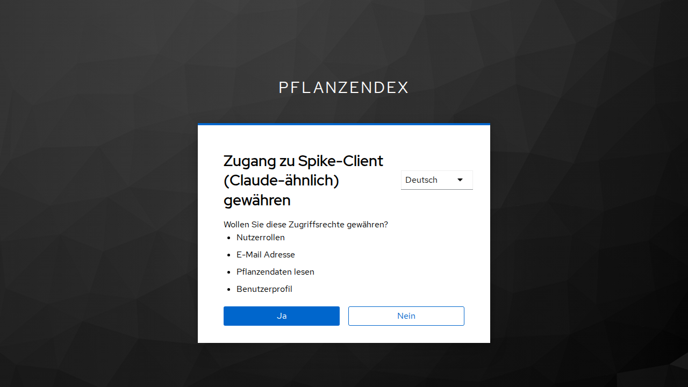

# Spike TE-15: OAuth authorization server for AI access (MCP)

As of: 2026-10-03 · Ticket TE-15 · Backs decisions E-03 (sign-in service) and E-04 (AI access).

## Summary

- **Recommendation and decision: Keycloak** (self-hosted) as sign-in service and OAuth authorization server. Of the two candidates tested, only Keycloak meets our permission model (own scopes with step-up, `resource`/audience, consent, domain restriction of registration, JWT tokens).
- **Not proven:** the connection with the real clients. **Claude** failed to connect via the Client ID Metadata Document variant (CIMD) because of a Keycloak rejection (cause narrowed down, not fixed). **ChatGPT** and **Claude Code** were not tested. This is an open point, not a success (follow-up ticket TE-16).
- **Two Keycloak features we build on are still "experimental" in 26.8.0:** `cimd` and `resource-indicators`. This is an operations and change risk.
- The spike was ended at this point at the request of the project owner; the gaps named below were deliberately left open.

## Setup

Everything self-hosted via Docker, throwaway setup in this folder:

| Part | Content |
|---|---|
| `keycloak/` | Keycloak 26.8.0 with `--features=cimd,resource-indicators`, `start-dev`, H2 |
| `zitadel/` | Zitadel v4.19.4 following the official Compose setup (Traefik, API, login UI, Postgres) |
| `mcp-test-server/` | Minimal MCP server (Streamable HTTP, SDK 1.32.0) as OAuth resource server: Protected Resource Metadata (RFC 9728), JWT validation (issuer, audience), three tools with the classes read, draft and write (`status`, `create_draft`, `watered`), step-up via `403 insufficient_scope` |
| `checks/` | Check scripts: discovery and DCR, full flow with browser login (Playwright), CIMD simulation, policies |

Tested first locally, then through public quick tunnels (Cloudflare) with the real clients.

## Result per criterion

| Criterion | Keycloak 26.8.0 | Zitadel v4.19.4 |
|---|---|---|
| Discovery | RFC 8414 and OIDC | OIDC only (sufficient per MCP spec) |
| PKCE | S256 and `plain` advertised | S256 only |
| Anonymous DCR (RFC 7591) | yes; **domain restriction** via the "Trusted Hosts" policy (`client-uris-must-match`) | yes; **no restriction of redirect hosts**, even `http://evil.example.org/cb` was accepted |
| Unknown fields in DCR | **400** (`UnrecognizedPropertyException`, issue #53363, open) | ignored (RFC 7591 §2) |
| CIMD | yes (experimental); clean document accepted; **document with the ChatGPT-typical field `token_endpoint_auth_methods_supported` rejected**; **document with grant `jwt-bearer` (like Claude's real document) rejected** | not available |
| `resource` (RFC 8707) | yes, with feature `resource-indicators`; wrong `resource` → `invalid_target`; `aud` = MCP URL | accepted and **ignored** (token issued even with wrong `resource`) |
| Own scopes, step-up | yes; `pflanzen:read/draft/write`; `403 insufficient_scope` → new authorization yields the higher permission | own scopes not proven: token response without `scope` field, content of the opaque token not verifiable |
| `iss` parameter (RFC 9207) | yes | not advertised |
| Consent | page exists (German), **but without selection of individual scopes** ("Ja"/"Nein") | **no consent page** |
| Token | JWT, 5 minutes, validation via JWKS | opaque (introspection with an own API application needed, not tried) |
| Refresh | rotation (new refresh token), revocation effective (`invalid_grant`) | rotation, revocation effective (`invalid_request`) |
| Operations | 1 container (plus database in production), approx. 800 MiB RAM in dev mode, start 10 s, image 474 MB | 4 containers (proxy, API, login UI, Postgres), together approx. 360 MiB RAM |
| UI | login and consent in German, theme customizable | login in German |



## Findings on Keycloak (configuration you need to know)

1. **Audience only via mapper:** the `resource-indicators` feature narrows the audience only to values that are already candidates in the token. The MCP server must be registered as a client with the attribute `resource_url` **and** an audience mapper must hang on the `pflanzen:*` scopes. Without mapper: `invalid_target`. Without the `resource` parameter the client ID instead of the URL ends up in `aud` (the server rejects this, intended).
2. **Securing registration:** by default "Trusted Hosts" blocks every anonymous DCR. For public clients the check of the sender IP is switched off and `client-uris-must-match` with the domains `claude.ai`, `chatgpt.com` is set instead. Then only clients with redirect URIs on these domains can be registered.
3. **Scopes:** the three scopes must be created as optional realm scopes and allowed in the "Allowed Client Scopes" policy. Otherwise the consent additionally shows default scopes ("Benutzerprofil", "Nutzerrollen", "E-Mail", as shown by the German Keycloak theme) that we would hide for these clients.
4. **Consent is all or nothing.** Deselecting individual permissions, as described in US-KI-07, is not possible with the default. This needs an own consent theme or an own consent step, or the story is adapted.
5. **PKCE `plain`** is advertised as well. ChatGPT requires S256; the restriction to S256 should be enforced via a client policy.
6. **CIMD policy:** configured via a client policy profile (`client-id-metadata-document`: `cimd-allow-permitted-domains`, `cimd-resource-indicator-allow-list`, …) and the condition `client-id-uri`. The domains apply to **all** URL fields of the document, not only to the client ID.

## Findings on the real clients

- **Claude (claude.ai, custom connector):** Claude's server fetched `initialize` and the Protected Resource Metadata (both answered correctly); the login attempt ended in Keycloak with "invalid request" (event `LOGIN_ERROR`, `client_policy_error`). Claude apparently used the client ID `https://claude.ai/oauth/mcp-oauth-client-metadata` (CIMD; inferred from the error pattern, the request itself was not visible in the logs). Its public document declares `token_endpoint_auth_method: none` **and** the grant `urn:ietf:params:oauth:grant-type:jwt-bearer`. A copy of this document, differing only in the grant `jwt-bearer`, triggers the same error. The executor flag `accept-public-client-with-confidential-client-only-grant` should have changed that according to the description in the source code, but had no effect in the tests. **Whether the value was actually stored in the policy is unresolved** (the queried configuration did not contain the key). Not tested: Claude's option "register automatically" (DCR) and "own OAuth client".
- **ChatGPT:** not tested. Simulation: a CIMD document with `token_endpoint_auth_methods_supported` fails in Keycloak 26.8.0 with "Client Metadata fetch failed" (cause in the log: `UnrecognizedPropertyException`). Keycloak issue #51039 about exactly this case is closed; the fix does not take effect in this version. According to the OpenAI docs ChatGPT also supports DCR and pre-registered clients; whether ChatGPT's DCR body contains the field is unknown.
- **Claude Code:** not tested.

## Not checked

Ory Hydra (only with own login and user management), Authentik, Gemini and further clients, introspection with Zitadel, long-running operation and upgrade behavior, theme customization, load tests, failure and backup behavior of Keycloak.

## Assessment and recommendation

Keycloak is the only candidate with which our permission model (scopes, step-up, audience, consent, controlled registration) works without a custom-built layer. Zitadel drops out after the test: own scopes not proven, `resource` is ignored, no consent, open registration without host restriction, opaque tokens.

Price of the decision for Keycloak:

- **Experimental features** (`cimd`, `resource-indicators`) in production; updates have to be tested carefully.
- **Client compatibility open:** the two most important clients could not be connected successfully. Possible ways (check in this order): Claude via DCR instead of CIMD; ChatGPT via a **pre-registered shared client** (redirect pattern `https://chatgpt.com/connector/oauth/*` and the stable URI); a small proxy that strips unknown fields from DCR bodies; fix or patch at Keycloak (issues #53363, #51039).
- **Consent without deselection:** adapt US-KI-07 or build an own consent theme.
- **Operations:** one additional service with a Java runtime, backups and updates (risk R-09 in `16`).

## Consequences for spec and backlog

- E-03: Keycloak as sign-in service decided in principle (spec `16`, ticket #22).
- E-04: open point "test with real clients" remains, now with a concrete state (spec `16`, ticket #23).
- New ticket **TE-16**: prove the connection of Claude and ChatGPT to Keycloak (follow-up work from this spike).
- Spec `12`, open questions: consent without deselection of individual permissions.
- No dates, no numbers without measurement: the operating figures above come from dev mode with one user and cannot be transferred to production.

## Reproduction

```bash
# Keycloak (set the hostname for tunnel tests via KC_HOSTNAME)
cd keycloak && docker compose -p te15-kc up -d
cd ../checks && npm install && npx playwright install chromium
node setup-keycloak.mjs && node 02-kc-policies.mjs && node 03-kc-resource.mjs http://localhost:18081/mcp && node 05-kc-audience.mjs
# MCP test server
cd ../mcp-test-server && npm install && AS_ISSUER=http://localhost:18080/realms/pflanzendex RESOURCE_URL=http://localhost:18081/mcp node server.mjs
# Flow test (other terminal)
cd ../checks && node 04-flow-keycloak.mjs
```

Tests with cloud clients need public HTTPS addresses for Keycloak and the MCP server. In this environment `cloudflared` worked only in the Docker container with `--dns 1.1.1.1` (WSL's DNS resolver did not resolve Cloudflare's SRV records). Admin and test passwords in `checks/11-kc-harden.mjs` are random values that end up in an uncommitted file.

## Sources

- MCP specification, Authorization section: https://modelcontextprotocol.io/specification/latest/basic/authorization
- Keycloak, MCP as authorization server: https://www.keycloak.org/securing-apps/mcp-authz-server
- Keycloak issues: #51039 (CIMD, closed), #53363 (DCR with unknown fields, open)
- Zitadel, Dynamic Client Registration: https://zitadel.com/docs/guides/integrate/dynamic-client-registration
- OpenAI, OAuth requirements for connectors: https://developers.openai.com/plugins/build/auth
- Claude, custom connectors: https://support.claude.com/en/articles/11175166-get-started-with-custom-connectors-using-remote-mcp
