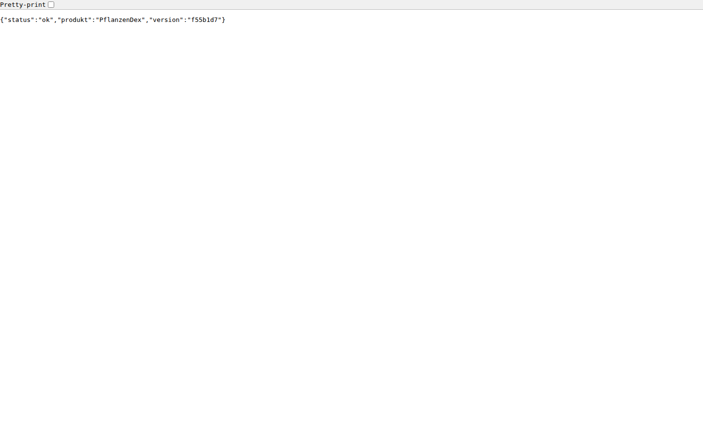

# Testprotokoll — Welle 1: TE-04, TE-02, TE-03 (gegen `dev`)

**PRs:** [#185](https://github.com/PflanzenDex/PflanzenDex/pull/185) (TE-04, `feat/te-04-operationen`), [#186](https://github.com/PflanzenDex/PflanzenDex/pull/186) (TE-02, `feat/te-02-db-mandanten`), [#187](https://github.com/PflanzenDex/PflanzenDex/pull/187) (TE-03, `feat/te-03-deploy`), alle mit Ziel `dev`
**Getestet auf:** lokaler Integrationsstand `docs/testprotokoll-wave1` = `origin/dev` @ `eb03231` + die drei PR-Branches (Merge-Reihenfolge #185, #186, #187), Stand `f55b1d7`. Nur lokal gemerged, nichts auf die PR-Branches gepusht.
**Umgebung:** WSL2/Linux, Node 24, Docker Compose, Datum 2026-10-03; Stack aus #187 mit `SITE_ADDRESS=localhost`, `HTTPS_PORT=8443`, Wegwerf-Passwort in einer nicht eingecheckten `.env`
**Methode:** Zusammenführen der drei Branches, `make ci`, gezielte Testläufe (Mandantentest, Operationen), `make restore-test`, Compose-Stack bauen und starten, Playwright-Screenshots (Desktop 1440×900, Mobil 375×812). Screenshots in `wave1/`.

Legende: ✅ wie erwartet · ⚠️ funktioniert, aber Auffälligkeit · ❌ Fehler · ⏭️ nicht geprüft

---

## 0. Zusammenführen der drei Branches

**Erwartet:** Die drei PRs lassen sich ohne Konflikt auf `dev` vereinen.

**Beobachtet:**
- ✅ #185 (TE-04) gemerged ohne Konflikt.
- ✅ #186 (TE-02) gemerged ohne Konflikt (nach #185).
- ⚠️ #187 (TE-03) **Konflikt in zwei Dateien** (nach #185 und #186):
  - `Makefile`: beide Seiten ändern die `.PHONY`-Zeile (#186: `db-up db-down migrate`, #187: `deploy backup restore-test`).
  - `app/README.md`: #186 fügt den Abschnitt „Datenbank und Mandantentrennung (TE-02)“ an, #187 den Absatz „Betrieb (TE-03)“, beide an derselben Stelle am Dateiende.
  - Beide Konflikte sind rein additiv. Für den Test wurden sie durch **Vereinigung beider Seiten** aufgelöst (`.PHONY` mit allen sechs Zielen; beide Textblöcke untereinander). Der Konflikt ist nicht still gelöst: die zuletzt gemergte PR muss ihn vor dem Merge selbst auflösen (Rebase auf `dev` nach dem Merge der anderen).

## 1. Gates: `make ci` (alle drei PRs zusammen)

**Erwartet:** Lint, Typprüfung, Architekturgrenzen, Format, Tests und Build laufen grün.

**Beobachtet:**
- ✅ `make ci` Exit-Code 0 (Test-Datenbank vorhanden, `make ci` nutzt sie).

```text
> eslint .                                   (ohne Meldung)
> tsc --noEmit -p .                          (je Paket, ohne Meldung)
Architekturgrenzen und Struktur: keine Verstöße.
All matched files use Prettier code style!
api   Tests  3 passed (3)
core  Tests 26 passed (26)
db    Tests 13 passed (13)
web   Tests  1 passed (1)
scripts: ℹ tests 12, pass 12, fail 0
vite v8.3.2 building client environment for production...
✓ 27 modules transformed. ✓ built in 137ms
```

## 2. TE-04 (#185): Schicht validierender Operationen

**Erwartet:** Operationen validieren die Eingabe vor jedem Schreiben (P-03), sind idempotent über einen Schlüssel je Nutzer, liefern Fehlercodes `<domäne>.<grund>` und prüfen den Zugriff zentral.

**Beobachtet** (`vitest --reporter=verbose` in `packages/core`, 26 Tests grün, Auszug):

```text
✓ Operationen: Idempotenz > legt bei gültiger Eingabe genau einen Eintrag an
✓ Operationen: Idempotenz > Doppelaufruf mit gleichem Schlüssel erzeugt keinen Doppeleintrag
✓ Operationen: Idempotenz > gleicher Schlüssel, andere Eingabe: idempotenz.schluessel_konf…
✓ Operationen: Idempotenz > Schlüssel ist je Nutzer getrennt (P-04)
✓ Operationen: Idempotenz > fachlicher Fehler gibt den Schlüssel frei …
✓ Operationen: Idempotenz > Ausnahme in der Operation wird zu system.unerwartet mit Ursache
✓ P-03 ungültige Eingabe schreibt nichts > lehnt null / "text" / [] / {} / {"name":""} / {"name":5} ab
✓ P-03 ungültige Eingabe schreibt nichts > ungültige Eingabe reserviert den Idempotenz-Schlüssel nicht
✓ P-03 ungültige Eingabe schreibt nichts > verwirft unbekannte Felder
✓ zentraler Zugriffscheck > ohne Anmeldung: zugriff.nicht_angemeldet, nichts geschrieben
✓ zentraler Zugriffscheck > zusätzliche Berechtigung verweigert: zugriff.verweigert
Test Files 3 passed (3)   Tests 26 passed (26)
```

- ✅ Alle genannten Eigenschaften sind durch ausgeführte Tests belegt; `core` bleibt frei von Node-/Fremdimporten (Grenzprüfung grün).
- ⚠️ Die Operationen arbeiten gegen Ports mit einem Speicher im Test (`testhilfe.ts`). Eine Anbindung an die Datenbank aus #186 (Idempotenzschlüssel, `mitKonto`) gibt es in dieser Welle noch nicht und wurde nicht geprüft. Die API (`/health`) nutzt die Schicht noch nicht.

## 3. TE-02 (#186): Mandantengrundlage, RLS, Zwei-Konten-Testrahmen

**Erwartet:** Jede nutzerbezogene Tabelle ist per Row-Level-Security getrennt; Konto A sieht und ändert nichts von Konto B; eine neue Tabelle ohne Schutz lässt den Test scheitern; Migrationen nur vorwärts mit Prüfsumme.

**Beobachtet** (`vitest --reporter=verbose` in `packages/db`, 13 Tests grün):

```text
✓ Mandantentrennung > Konto A liest und ändert nichts von Konto B (und umgekehrt), für jede Tabelle mit Konto-Kennung
✓ Mandantentrennung > das Schema hat keine Tabelle ohne Konto-Kennung und keine ohne erzwungene Zeilenregel
✓ … eine neue Tabelle ohne Konto-Kennung fällt auf
✓ … eine Tabelle mit Konto-Kennung, aber ohne Zeilenregel, fällt auf
✓ … eine geschützte Tabelle ohne Fixture lässt den generischen Test scheitern
✓ … ein defekter Schutz wird vom generischen Test erkannt (Regel erlaubt Fremdzugriff)
✓ Sitzungsvariable > ohne Konto in der Sitzung sieht die Anwendung nichts (sicherer Ausgang)
✓ Sitzungsvariable > die Variable gilt nur in der Transaktion und leckt nicht in die nächste (Pool-Wiederverwendung)
✓ Sitzungsvariable > lehnt eine Konto-Kennung ab, die keine UUID ist (kein Einschleusen)
✓ Sitzungsvariable > bei einem Fehler im Rumpf wird zurückgerollt
✓ Migrationswerkzeug > wendet Dateien in Namensreihenfolge einmal an und merkt sich sie
✓ Migrationswerkzeug > bricht ab, wenn eine bereits angewendete Migration nachträglich geändert wurde
✓ Migrationswerkzeug > rollt eine fehlerhafte Migration vollständig zurück und lässt nichts halb angewendet
Test Files 2 passed (2)   Tests 13 passed (13)
```

- ✅ Mandantentest einschließlich der „Gegenproben“ (defekter Schutz, fehlende Fixture) bestanden gegen echtes PostgreSQL 16 (Container `pflanzendex-test-db`).
- ⚠️ Die Tests laufen gegen eine bereits laufende Test-Datenbank; ein Kaltstart (`make db-down`, dann `make ci`) wurde nicht gesondert durchgespielt.

## 4. TE-03 (#187): Container, Compose, Backup/Restore, Runbook

### 4.1 Wiederherstellungstest `make restore-test`

**Erwartet:** Wegwerf-Postgres, 500 Testzeilen sichern, in zweite Datenbank einspielen, Zeilenzahl und Prüfsumme gleich; Betriebsdatenbank unberührt.

```text
$ make restore-test
CREATE TABLE
INSERT 0 500
Sicherung geschrieben: /tmp/tmp.EE81uIlBGE/backups/pflanzendex-20261003T081918Z.dump
CREATE DATABASE
Wiederhergestellt aus …/pflanzendex-20261003T081918Z.dump
OK: Wiederherstellungstest bestanden (500:853278bed16baa13e8a09dc798bbb906)
```

**Beobachtet:** ✅ Exit-Code 0, 500 Zeilen mit gleicher Prüfsumme.

### 4.2 Compose-Stack (Build und Start)

**Erwartet:** `docker compose … up -d --build` baut `api` und `web`, startet `db`, `api`, `web`, `proxy`; `api` und `db` werden „healthy“; die Datenbank ist nicht veröffentlicht.

```text
NAME                  STATUS                    PORTS
pflanzendex-api-1     Up 23 seconds (healthy)   3000/tcp
pflanzendex-db-1      Up 33 seconds (healthy)   5432/tcp
pflanzendex-proxy-1   Up 22 seconds             … 0.0.0.0:8080->80/tcp, 0.0.0.0:8443->443/tcp
pflanzendex-web-1     Up 33 seconds             80/tcp, …
```

**Beobachtet:**
- ✅ Build und Start fehlerfrei; die Datenbank ist nur im Compose-Netz (Port 5432 nicht auf den Host veröffentlicht).
- ✅ `curl -k https://localhost:8443/health` → `HTTP/2 200`, Body `{"status":"ok","produkt":"PflanzenDex","version":"f55b1d7"}` (`version` = Commit des Builds, `GIT_SHA` über die `.env`).
- ⚠️ `http://localhost:8080/health` antwortet `308` auf `https://localhost/health` **ohne Port 8443**. Nur bei der lokalen Nicht-Standard-Port-Konfiguration relevant, auf Staging mit 80/443 unkritisch; im Runbook erwähnenswert.
- ⚠️ **Die Datenbank im Stack ist leer** (`\dt` → „Did not find any relations“). Weder `api` noch `deploy.sh` wenden die Migrationen aus #186 an (`make migrate` gibt es nur gegen `DATABASE_URL`). Solange die API die DB nicht nutzt, folgenlos; vor der ersten datenbankabhängigen Funktion braucht das Deploy einen Migrationsschritt (das Runbook erwähnt „Migrationen“ nur als offenen Punkt).

### 4.3 /health über HTTPS (Desktop 1440×900)

**Erwartet:** JSON mit Status, Produktname, Version über HTTPS.



**Beobachtet:**
- ✅ Status 200, Inhalt wie oben.
- ⚠️ Das Zertifikat stammt von der internen CA von Caddy (`localhost`); der Browser meldet `ERR_CERT_AUTHORITY_INVALID`. Der Screenshot entstand mit `ignoreHTTPSErrors`. Erwartet bei `localhost`; ein öffentlich vertrauenswürdiges Zertifikat setzt Domain und DNS voraus (siehe 4.5).

### 4.4 Web-App (Desktop und Mobil)

**Erwartet:** Die statische PWA wird über den Proxy ausgeliefert.


**Beobachtet:**
- ✅ Status 200, Titel „PflanzenDex“, Überschrift „PflanzenDex“, keine Konsolenfehler und keine Seitenfehler.
- ⚠️ Die Seite ist ein reines Gerüst (unformatierte Überschrift, sonst leer). Das ist für TE-01/TE-03 erwartet, aber es gibt noch keine bedienbare Oberfläche; ein Mobil-/Layout-Urteil ist nicht möglich.

### 4.5 Nicht ausgeführt

- ⏭️ `make deploy` / `deploy.sh` (holt `origin/main`; ein Deploy von `main` ist mangels Inhalt nicht sinnvoll und hätte den Host verändert).
- ⏭️ `make backup` gegen den laufenden Stack (nur im Wiederherstellungstest 4.1 mit demselben Skript `backup.sh` indirekt ausgeführt).
- ⏭️ `BACKUP_REMOTE` (rsync an zweiten Ort): kein Ziel vorhanden.
- ⏭️ Erreichbarkeit von außen mit öffentlichem Zertifikat: keine Domain (laut Runbook offen).
- ⏭️ `restore.sh` über die Betriebsdatenbank (`CONFIRM=ja`).

## 5. Aufräumen

- ✅ Alle von mir gestarteten Compose-Container, Volumes und das Netz (`pflanzendex_*`) entfernt (`down -v`); die temporäre `app/deploy/.env` gelöscht.
- Der bereits vorher laufende Container `pflanzendex-test-db` (Test-Datenbank aus `make db-up`) und fremde Container wurden nicht angefasst.

## 6. Empfehlung

| PR | Empfehlung | Begründung |
| --- | --- | --- |
| #185 TE-04 | **mergen** | Tests belegen Validierung, Idempotenz, Fehlercodes und Zugriffscheck; keine Konflikte; `make ci` grün. Anbindung an die DB folgt später. |
| #186 TE-02 | **mergen** | Generischer Mandantentest inkl. Gegenproben grün gegen echtes PostgreSQL; Migrationswerkzeug verhält sich wie spezifiziert; keine Konflikte. |
| #187 TE-03 | **mergen, nach Auflösung des Konflikts** | Stack baut und startet, `/health` über HTTPS liefert Version, DB nicht veröffentlicht, Restore-Test bestanden. Vor dem Merge: Konflikt in `Makefile` und `app/README.md` mit #186 lösen (additiv, siehe 0). Offene Punkte (Migrationsschritt im Deploy, Domain, `BACKUP_REMOTE`) sind im Runbook teils benannt und blockieren nicht. |

Reihenfolge: #185 und #186 zuerst, dann #187 auf `dev` rebasen.
