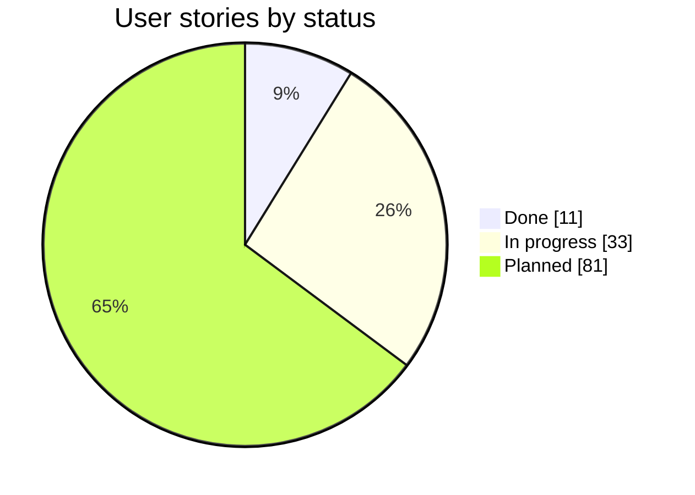
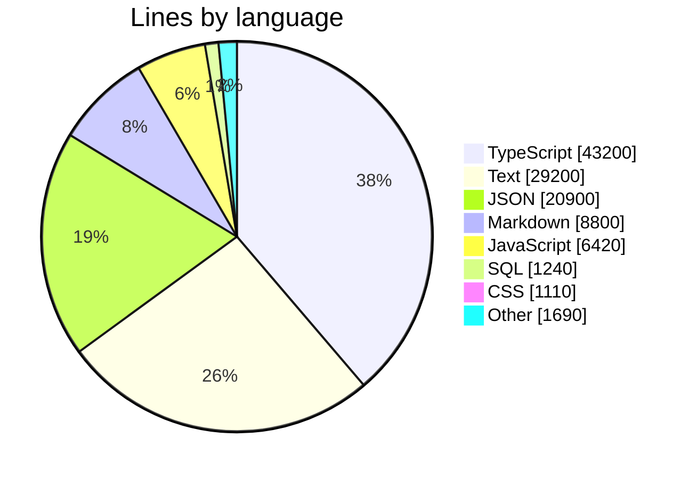
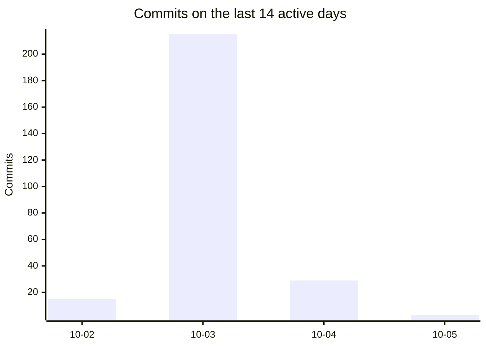
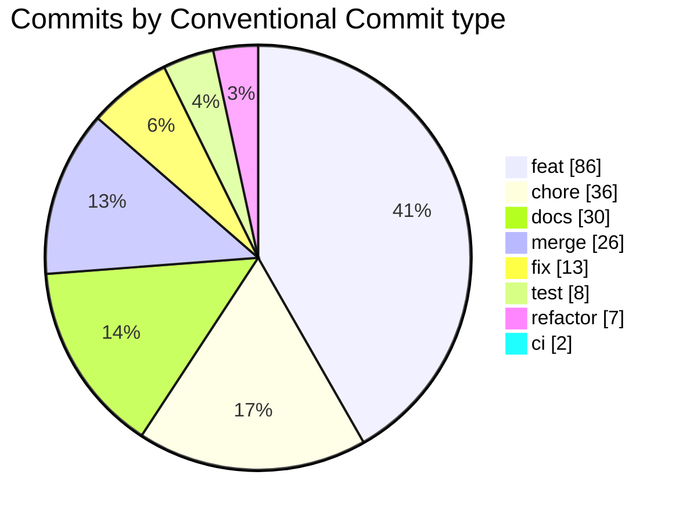

# PflanzenDex

A multi-user, mobile-first web app (PWA) for houseplant collectors: a shared species catalog, your own specimens with light zones and care phases, growth tracking, a wishlist and a Pokédex of the species you have caught.

- **Specs:** [`Docs/PRODUCT-SPECS/`](Docs/PRODUCT-SPECS/README.md) is the authoritative product spec (principles, domain model, release cut).
- **Code:** [`app/`](app/README.md) is a TypeScript monorepo (`core`, `db`, `api`, `web`).
- **Contributing:** [`CONTRIBUTING.md`](CONTRIBUTING.md) and, for AI agents, [`AGENTS.md`](AGENTS.md).

```bash
make setup   # install dependencies and git hooks
make dev     # start API and web
make ci      # all gates: lint, types, boundaries, format, tests, build
```

## Repository statistics

<!-- repo-stats:start (generated by scripts/repo-stats.sh, do not edit by hand) -->

_Generated by `scripts/repo-stats.sh` before every commit (US-DEV-10). Tree numbers come from the committed files, rounded to 3 significant digits; history numbers come from `dev` up to this branch's base._

### At a glance

| Size | Code | Quality | Process |
| --- | --- | --- | --- |
| 947 files | 25.7k lines of production code | 170 test files | 5 ADRs |
| 113k lines | 5 packages · 20 migrations | 1.63k test cases | 9 skills |
| 43.7 MiB tracked | 39 error codes | 26.9k lines of tests (104% of code) | 3 runbooks |

### Product progress

125 user stories and 144 functional requirements in `Docs/PRODUCT-SPECS/`. Stories: 11 ✅ done, 33 🟨 in progress, 81 ⬜ planned. Requirements: 9 ✅, 16 🟨.

| Epic | Stories | ✅ | 🟨 | ⬜ | Progress |
| --- | --: | --: | --: | --: | --- |
| ACC Accounts | 5 | 2 | 2 | 1 | `████▒▒▒▒░░` |
| BES Collection | 10 | 2 | 8 | 0 | `██▒▒▒▒▒▒▒▒` |
| LIC Light and locations | 5 | 1 | 3 | 1 | `██▒▒▒▒▒▒░░` |
| PHA Care phases | 4 | 1 | 2 | 1 | `███▒▒▒▒▒░░` |
| WAC Growth/photos | 6 | 0 | 1 | 5 | `▒▒░░░░░░░░` |
| BEH Treatments | 4 | 4 | 0 | 0 | `██████████` |
| WUN Wishlist | 5 | 0 | 1 | 4 | `▒▒░░░░░░░░` |
| POK Pokédex | 10 | 0 | 4 | 6 | `▒▒▒▒░░░░░░` |
| MON Reminders/sensors | 8 | 0 | 0 | 8 | `░░░░░░░░░░` |
| SOZ Social | 13 | 0 | 0 | 13 | `░░░░░░░░░░` |
| EQU Equipment | 12 | 0 | 0 | 12 | `░░░░░░░░░░` |
| KI AI access | 10 | 0 | 0 | 10 | `░░░░░░░░░░` |
| QS Cross-cutting | 7 | 0 | 1 | 6 | `▒░░░░░░░░░` |
| ENT Discover | 8 | 0 | 0 | 8 | `░░░░░░░░░░` |
| QG Quality gates | 8 | 0 | 6 | 2 | `▒▒▒▒▒▒▒▒░░` |
| DEV Development process | 10 | 1 | 5 | 4 | `█▒▒▒▒▒░░░░` |



### Notable features

Stories marked done (✅) in the spec:

- **US-ACC-01** Register and sign in
- **US-ACC-03** Guided onboarding
- **US-BES-03** Tell several specimens of a species apart
- **US-BES-05** Compare species by difficulty
- **US-LIC-05** Manage locations and light zones
- **US-PHA-02** See deviations first
- **US-BEH-01** Plan treatment dates
- **US-BEH-02** See open dates by urgency
- **US-BEH-03** Tick off a date with a tap
- **US-BEH-04** See an open treatment on the specimen card
- **US-DEV-10** Repository statistics in the README

<details><summary>33 stories in progress (🟨)</summary>

- **US-ACC-02** Profile and settings
- **US-ACC-05** Access by invitation only (initial phase)
- **US-BES-01** Choose a species from the catalog or create a new one
- **US-BES-02** Create a specimen
- **US-BES-04** Create a cutting and pot it
- **US-BES-06** See specimens as cards
- **US-BES-07** Archive a deceased or given-away plant
- **US-BES-08** Recognize incomplete data
- **US-BES-09** Adjust my own care profile per species
- **US-BES-10** Review and approve catalog proposals
- **US-LIC-01** Assign a species to the right light zone
- **US-LIC-02** Know where there is still room
- **US-LIC-03** Know how close the plant belongs to the lamp
- **US-PHA-01** See which phase every plant should be in
- **US-PHA-03** Confirm the move with a tap
- **US-WAC-01** Record a measurement
- **US-WUN-01** See candidates prioritized by space need
- **US-POK-06** Derive ownership automatically from my plants
- **US-POK-07** Catch date and photo honest
- **US-POK-08** Search, filter, sort
- **US-POK-09** View details of a species
- **US-QS-03** Repeatable without fear
- **US-QG-01** Find errors early and locally
- **US-QG-03** Architecture boundaries are checked by machine
- **US-QG-04** Spec, code and test visibly belong together
- **US-QG-06** Gates mature instead of blocking what nobody can meet
- **US-QG-07** AI agents work within the same gates
- **US-QG-08** Complexity stays manageable
- **US-DEV-01** One entry point for all tasks (task runner)
- **US-DEV-02** Hooks catch early without annoying
- **US-DEV-04** Skills and playbooks for recurring tasks
- **US-DEV-06** Release process
- **US-DEV-08** Parallel work without collisions

</details>

### Code



| Package | Lines of code |
| --- | --: |
| `web` | 17.3k |
| `core` | 14.1k |
| `db` | 7.01k |
| `api` | 6.68k |
| `e2e` | 412 |

### History

262 commits by 4 people since 2026-10-02. Latest release: `v0.0.0`.





Latest features:

- feat(wun): prioritize wishlist candidates by space need (US-WUN-01) (#276)
- feat(acc): access by invitation only (US-ACC-05) (#290)
- feat(bes): back-date the catch date of a specimen (FR-BES-04) (#288)
- feat(acc): guided onboarding and start page (US-ACC-03) (#283)
- feat(pok): view details of a caught species (US-POK-09) (#285)

<!-- repo-stats:end -->
