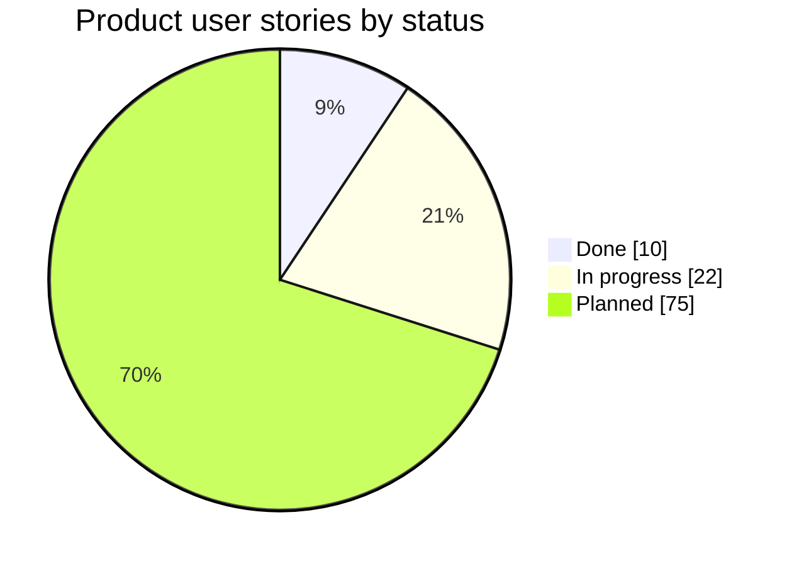
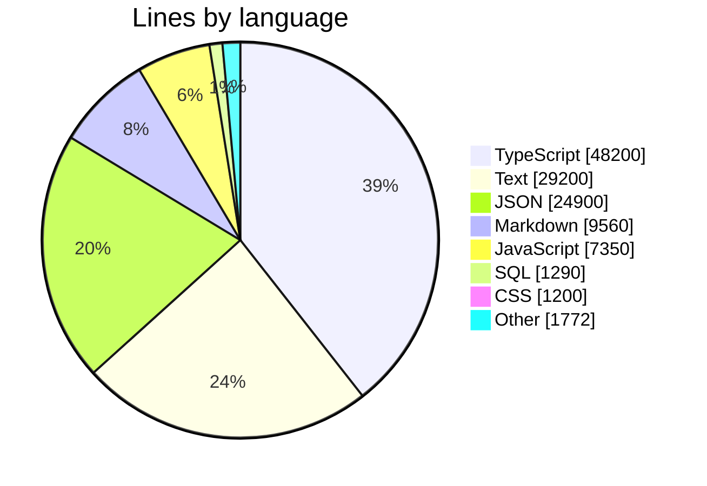
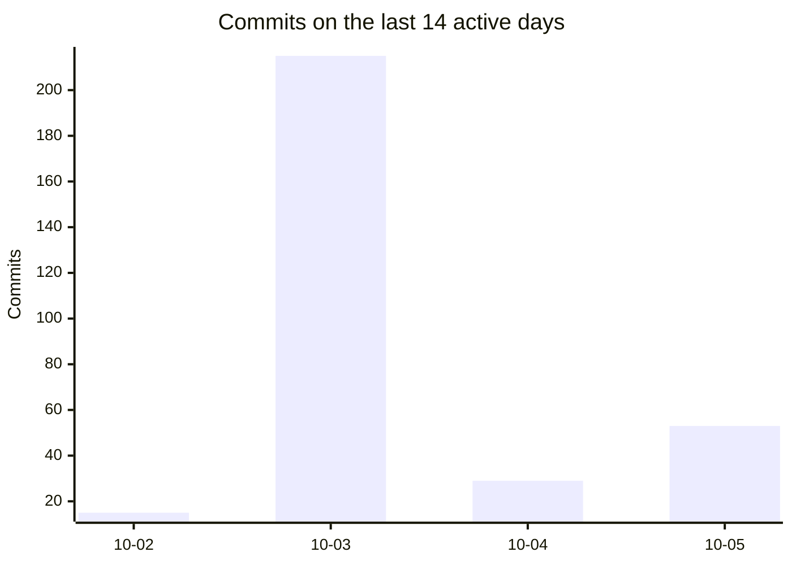

# PflanzenDex

A multi-user, mobile-first web app (PWA) for houseplant collectors: a shared species catalog, your own specimens with light zones and care phases, growth tracking, treatments, a wishlist and a Pokédex of the species you have caught.

[Specs](Docs/PRODUCT-SPECS/README.md) · [App code](app/README.md) · [Contributing](CONTRIBUTING.md) · [Rules for AI agents](AGENTS.md)

<!-- repo-stats:start (generated by scripts/repo-stats.sh, do not edit by hand) -->

## What PflanzenDex does

The product is cut into 14 feature areas (epics): **1 complete, 8 in progress, 5 planned.** Each area links to its spec; progress counts user stories (█ done, ▒ in progress, ░ planned).

| Status | Area | What it covers | Stories | Progress |
| :-: | --- | --- | --- | --- |
| ✅ | **Treatments** · [BEH](Docs/PRODUCT-SPECS/06-Treatments.md) | Pests, diseases, courses of treatment | 4 ✅ · 0 🟨 · 0 ⬜ | `██████████` |
| 🟨 | **Accounts** · [ACC](Docs/PRODUCT-SPECS/01-Accounts-and-Onboarding.md) | Account, sign-in, profile, invitation | 2 ✅ · 2 🟨 · 1 ⬜ | `████▒▒▒▒░░` |
| 🟨 | **Collection** · [BES](Docs/PRODUCT-SPECS/02-Collection.md) | Species catalog, care profile, review, specimens, cutting, archive | 2 ✅ · 8 🟨 · 0 ⬜ | `██▒▒▒▒▒▒▒▒` |
| 🟨 | **Light and locations** · [LIC](Docs/PRODUCT-SPECS/03-Light-and-Locations.md) | Light zones, locations, distribution, position | 1 ✅ · 3 🟨 · 1 ⬜ | `██▒▒▒▒▒▒░░` |
| 🟨 | **Care phases** · [PHA](Docs/PRODUCT-SPECS/04-Care-Phases.md) | Dormancy/growth phase, location reconciliation | 1 ✅ · 2 🟨 · 1 ⬜ | `███▒▒▒▒▒░░` |
| 🟨 | **Growth/photos** · [WAC](Docs/PRODUCT-SPECS/05-Growth-and-Photos.md) | Measurement, trend, etiolation, photos | 0 ✅ · 1 🟨 · 5 ⬜ | `▒▒░░░░░░░░` |
| 🟨 | **Wishlist** · [WUN](Docs/PRODUCT-SPECS/07-Wishlist.md) | Purchase candidates, buffer, path to the plant | 0 ✅ · 1 🟨 · 4 ⬜ | `▒▒░░░░░░░░` |
| 🟨 | **Pokédex** · [POK](Docs/PRODUCT-SPECS/08-Pokedex.md) | Collector cards, taxonomy, milestones | 0 ✅ · 4 🟨 · 6 ⬜ | `▒▒▒▒░░░░░░` |
| 🟨 | **Cross-cutting** · [QS](Docs/PRODUCT-SPECS/14-Cross-Cutting.md) | Privacy, security, mobile, quality | 0 ✅ · 1 🟨 · 6 ⬜ | `▒░░░░░░░░░` |
| ⬜ | **Reminders/sensors** · [MON](Docs/PRODUCT-SPECS/09-Reminders-and-Sensors.md) | Notifications, watering, sensors | 0 ✅ · 0 🟨 · 8 ⬜ | `░░░░░░░░░░` |
| ⬜ | **Social** · [SOZ](Docs/PRODUCT-SPECS/10-Social.md) | Friends, feed, swapping | 0 ✅ · 0 🟨 · 13 ⬜ | `░░░░░░░░░░` |
| ⬜ | **Equipment** · [EQU](Docs/PRODUCT-SPECS/11-Equipment-and-Recommendations.md) | Equipment, need, affiliate | 0 ✅ · 0 🟨 · 12 ⬜ | `░░░░░░░░░░` |
| ⬜ | **AI access** · [KI](Docs/PRODUCT-SPECS/12-AI-Assistant.md) | AI access via an open interface, tasks, drafts, care by voice, profiles, photo assessment | 0 ✅ · 0 🟨 · 10 ⬜ | `░░░░░░░░░░` |
| ⬜ | **Discover** · [ENT](Docs/PRODUCT-SPECS/17-Discover.md) | Swipe suggestions from the catalog, matching light and thriving plants, filling the wishlist | 0 ✅ · 0 🟨 · 8 ⬜ | `░░░░░░░░░░` |



## Engineering

| | |
| --- | --- |
| **Repository** | 1.04k files · 123k lines · 44 MiB |
| **Production code** | 28.7k lines · packages: web 12.1k · core 6.81k · db 3.61k · api 1.34k |
| **Tests** | 201 files · 1.81k test cases · 30.0k lines (105% of production code) |
| **Database** | 21 migrations · 40 error codes |
| **Process docs** | 7 ADRs · 9 agent skills · 3 runbooks |

### Quality gates and development process

| Status | Area | What it covers | Stories | Progress |
| :-: | --- | --- | --- | --- |
| 🟨 | **Quality gates** · [QG](Docs/PRODUCT-SPECS/18-Architecture-and-Quality-Gates.md) | Hooks, CI, structure rules, architecture boundaries, complexity, privacy gates, DoD | 0 ✅ · 6 🟨 · 2 ⬜ | `▒▒▒▒▒▒▒▒░░` |
| 🟨 | **Development process** · [DEV](Docs/PRODUCT-SPECS/19-Development-Process-and-Automation.md) | Task runner, hooks, routines, skills, process, release, migrations, operations | 1 ✅ · 5 🟨 · 4 ⬜ | `█▒▒▒▒▒░░░░` |



## Activity

312 commits by 4 people since 2026-10-02 · latest release `v0.0.0`



<sub>Generated by `scripts/repo-stats.sh` when a pull request is made ready (`make pr`, US-DEV-10). Code numbers come from the committed files, rounded to 3 significant digits; activity comes from `dev` up to this branch's base.</sub>

<!-- repo-stats:end -->

## Getting started

```bash
make setup   # install dependencies and git hooks
make dev     # start API and web
make ci      # all gates: lint, types, boundaries, format, tests, build
```

`make help` lists every task. Product rules, domain model and release cut start in [`Docs/PRODUCT-SPECS/README.md`](Docs/PRODUCT-SPECS/README.md).
