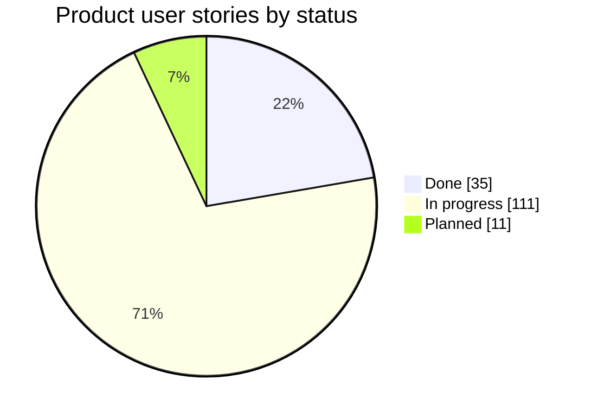
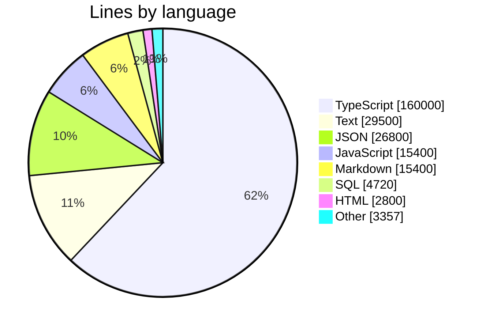
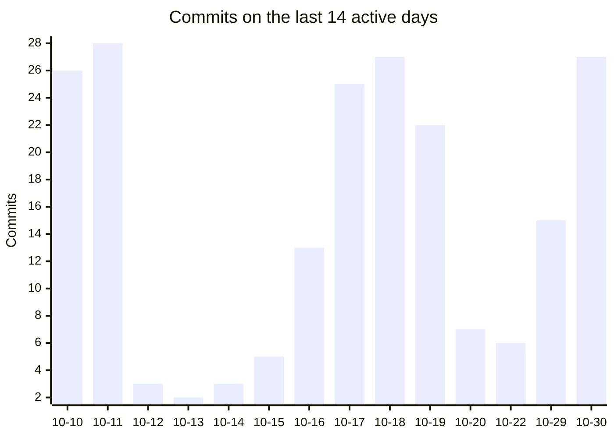

# PflanzenDex

A multi-user, mobile-first web app (PWA) for houseplant collectors: a shared species catalog, your own specimens with light zones and care phases, growth tracking, treatments, a wishlist and a Pokédex of the species you have caught.

[Specs](docs/specs/product/readme.md) · [App code](docs/guides/reference/app.md) · [Contributing](CONTRIBUTING.md) · [Rules for AI agents](AGENTS.md)

<!-- repo-stats:start (generated by tools/repo/repo-stats.sh, do not edit by hand) -->

## What PflanzenDex does

The product is cut into 17 feature areas (epics): **1 complete, 16 in progress, 0 planned.** Each area links to its spec; progress counts user stories (█ done, ▒ in progress, ░ planned).

| Status | Area                                                                                        | What it covers                                                                                                | Stories             | Progress     |
| :----: | ------------------------------------------------------------------------------------------- | ------------------------------------------------------------------------------------------------------------- | ------------------- | ------------ |
|   ✅   | **Treatments** · [BEH](docs/specs/product/06-treatments.md)                                 | Pests, diseases, courses of treatment                                                                         | 4 ✅ · 0 🟨 · 0 ⬜  | `██████████` |
|   🟨   | **Accounts** · [ACC](docs/specs/product/01-accounts-and-onboarding.md)                      | Account, sign-in, profile, invitation                                                                         | 3 ✅ · 2 🟨 · 1 ⬜  | `█████▒▒▒░░` |
|   🟨   | **Collection** · [BES](docs/specs/product/02-collection.md)                                 | Species catalog, enrichment from sources, corrections, care profile, review, specimens, cutting, archive      | 2 ✅ · 14 🟨 · 0 ⬜ | `█▒▒▒▒▒▒▒▒▒` |
|   🟨   | **Light and locations** · [LIC](docs/specs/product/03-light-and-locations.md)               | Light zones, locations, distribution, position                                                                | 4 ✅ · 1 🟨 · 0 ⬜  | `████████▒▒` |
|   🟨   | **Care phases** · [PHA](docs/specs/product/04-care-phases.md)                               | Dormancy/growth phase, location reconciliation                                                                | 2 ✅ · 2 🟨 · 0 ⬜  | `█████▒▒▒▒▒` |
|   🟨   | **Growth/photos** · [WAC](docs/specs/product/05-growth-and-photos.md)                       | Measurement, trend, etiolation, photos                                                                        | 4 ✅ · 2 🟨 · 0 ⬜  | `███████▒▒▒` |
|   🟨   | **Wishlist** · [WUN](docs/specs/product/07-wishlist.md)                                     | Purchase candidates, buffer, path to the plant                                                                | 0 ✅ · 5 🟨 · 0 ⬜  | `▒▒▒▒▒▒▒▒▒▒` |
|   🟨   | **Pokédex** · [POK](docs/specs/product/08-pokedex.md)                                       | Collector cards, taxonomy, milestones                                                                         | 0 ✅ · 11 🟨 · 1 ⬜ | `▒▒▒▒▒▒▒▒▒░` |
|   🟨   | **Reminders/sensors** · [MON](docs/specs/product/09-reminders-and-sensors.md)               | Notifications, watering, sensors                                                                              | 0 ✅ · 6 🟨 · 2 ⬜  | `▒▒▒▒▒▒▒▒░░` |
|   🟨   | **Social** · [SOZ](docs/specs/product/10-social.md)                                         | Friends, feed, swapping                                                                                       | 3 ✅ · 10 🟨 · 0 ⬜ | `██▒▒▒▒▒▒▒▒` |
|   🟨   | **Equipment** · [EQU](docs/specs/product/11-equipment-and-recommendations.md)               | Equipment, need, affiliate                                                                                    | 0 ✅ · 11 🟨 · 1 ⬜ | `▒▒▒▒▒▒▒▒▒░` |
|   🟨   | **AI access** · [KI](docs/specs/product/12-ai-assistant.md)                                 | AI access via an open interface, tasks, drafts, care by voice, profiles, photo assessment                     | 0 ✅ · 9 🟨 · 1 ⬜  | `▒▒▒▒▒▒▒▒▒░` |
|   🟨   | **Cross-cutting** · [QS](docs/specs/product/14-cross-cutting.md)                            | Privacy, security, mobile, quality                                                                            | 0 ✅ · 20 🟨 · 4 ⬜ | `▒▒▒▒▒▒▒▒░░` |
|   🟨   | **Discover** · [ENT](docs/specs/product/17-discover.md)                                     | Swipe suggestions from the catalog, matching light and thriving plants, filling the wishlist                  | 0 ✅ · 8 🟨 · 1 ⬜  | `▒▒▒▒▒▒▒▒▒░` |
|   🟨   | **Achievements** · [ACH](docs/specs/product/20-achievements.md)                             | Achievements for care and growth, care rhythm, personal records, anniversaries, year in review, calm mode     | 7 ✅ · 1 🟨 · 0 ⬜  | `█████████▒` |
|   🟨   | **Swipe matching** · [TAU](docs/specs/product/21-swipe-matching.md)                         | Swipe matching of friends' swap offers against the own wishlist, yes/no/later, fits both ways                 | 1 ✅ · 6 🟨 · 0 ⬜  | `█▒▒▒▒▒▒▒▒▒` |
|   🟨   | **Introduction and unlocking** · [ONB](docs/specs/product/22-introduction-and-unlocking.md) | Playful introduction, first plant first, keeper style, staged unlocking with visible locks, function overview | 5 ✅ · 3 🟨 · 0 ⬜  | `██████▒▒▒▒` |


```mermaid
pie showData title Product user stories by status
  "Done" : 35
  "In progress" : 111
  "Planned" : 11
```

## Engineering

|                     |                                                                       |
| ------------------- | --------------------------------------------------------------------- |
| **Repository**      | 2.49k files · 258k lines · 67 MiB                                     |
| **Production code** | 95.6k lines · packages: web 39.1k · core 22.9k · db 12.0k · api 9.16k |
| **Tests**           | 586 files · 5.06k test cases · 88.8k lines (93% of production code)   |
| **Database**        | 94 migrations · 94 error codes                                        |
| **Process docs**    | 18 ADRs · 9 agent skills · 6 runbooks                                 |

### Quality gates and development process

| Status | Area                                                                                         | What it covers                                                                      | Stories             | Progress     |
| :----: | -------------------------------------------------------------------------------------------- | ----------------------------------------------------------------------------------- | ------------------- | ------------ |
|   🟨   | **Quality gates** · [QG](docs/specs/product/18-architecture-and-quality-gates.md)            | Hooks, CI, structure rules, architecture boundaries, complexity, privacy gates, DoD | 0 ✅ · 8 🟨 · 2 ⬜  | `▒▒▒▒▒▒▒▒░░` |
|   🟨   | **Development process** · [DEV](docs/specs/product/19-development-process-and-automation.md) | Task runner, hooks, routines, skills, process, release, migrations, operations      | 1 ✅ · 10 🟨 · 1 ⬜ | `█▒▒▒▒▒▒▒▒░` |


```mermaid
pie showData title Lines by language
  "TypeScript" : 160000
  "Text" : 29500
  "JSON" : 26800
  "JavaScript" : 15400
  "Markdown" : 15400
  "SQL" : 4720
  "HTML" : 2800
  "Other" : 3357
```

## Activity

881 commits by 4 people since 2026-10-02 · latest release `v0.0.0`


```mermaid
xychart-beta
  title "Commits on the last 14 active days"
  x-axis ["10-10", "10-11", "10-12", "10-13", "10-14", "10-15", "10-16", "10-17", "10-18", "10-19", "10-20", "10-22", "10-29", "10-30"]
  y-axis "Commits"
  bar [26, 28, 3, 2, 3, 5, 13, 25, 27, 22, 7, 6, 15, 27]
```

<sub>Generated by `tools/repo/repo-stats.sh` when a pull request is made ready (`make pr`, US-DEV-10). Code numbers come from the committed files, rounded to 3 significant digits; activity comes from `dev` up to this branch's base.</sub>

<!-- repo-stats:end -->

## Getting started

```bash
make setup   # install dependencies and git hooks
make dev     # start API and web
make ci      # all gates: lint, types, boundaries, format, tests, build
```

`make help` lists every task. Product rules, domain model and release cut start in [`docs/specs/product/readme.md`](docs/specs/product/readme.md).
